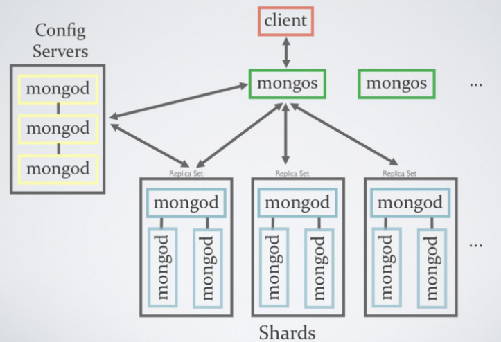

# MongoDB Shard Cluster\(VM\)

## Shard Cluster 구성 환경 

* 테스트 환경 : Windows 2019 Datacenter 표준 B2s\(2개 vcpu, 4GiB 메모리\)
* Azure VM 1대에 shard, config, router 모두 구성

## Shard Cluster 아키텍처

* MongoDB에서 권장하는 Sharding 구조\(캡처 이미지\) 
* 테스트 환경에서는 Config 서버 2대를 Replica set 구성하여 1대처럼 구성
* Shards 서버 mongod는 Replica set 구성 없이 단일 3대로 구성
* Config 서버의 경우 Replica set 구성 없이는 오류가 발생 

