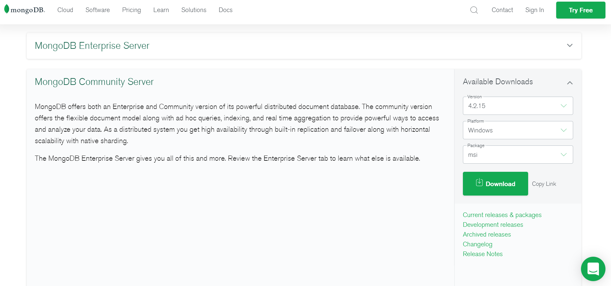
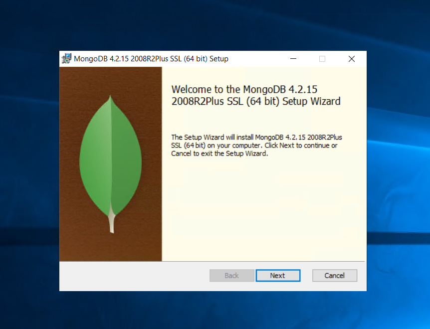
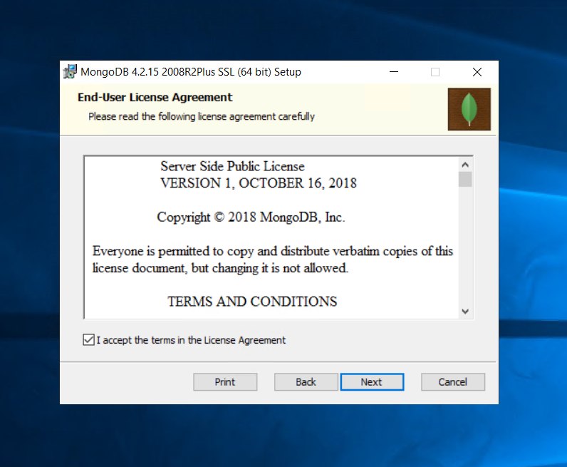
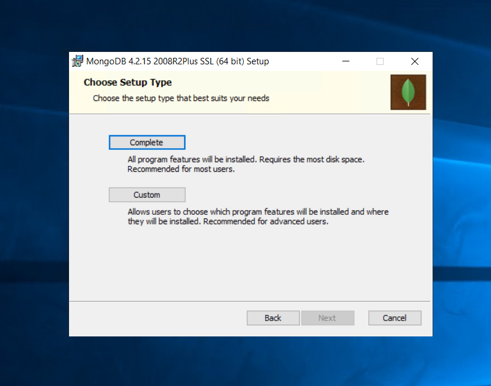
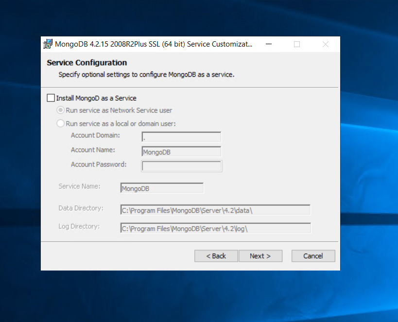
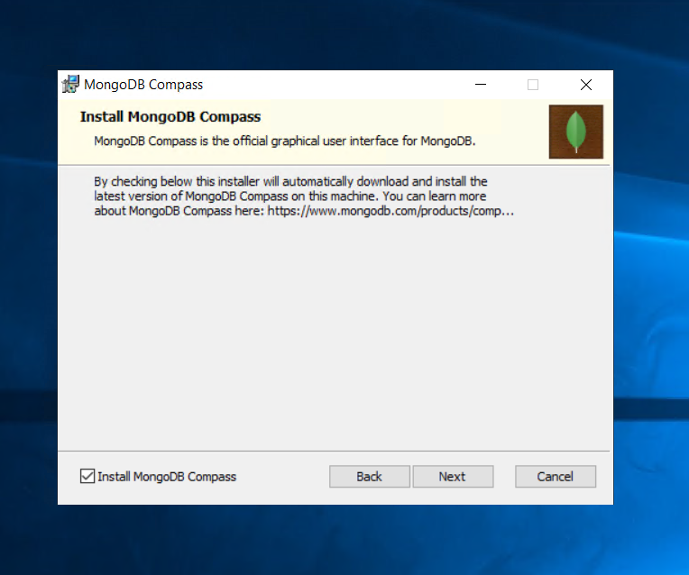
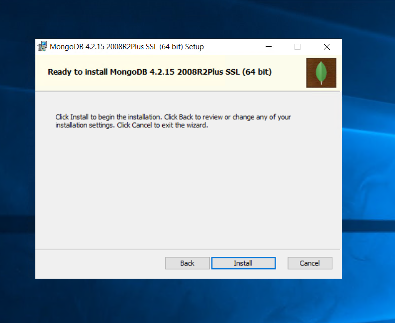

# 1. MongoDB 설치

## MongoDB Comunity 버전 다운로드 



## MongoDB MSI 설치 

MSI 설치프로그램 실행

다음

다음

Complete 선택, 다음

Install MongoD as a Service 체크 제외 후 설치\(체크시 기본 디렉토리 및 설정이 적용됨\)

Install MongoDB Compass 체크 후 다음\(Compass는 DB접속 및 관리툴임\)

Install 클릭 후 설치

## MongoDB 환경 변수 세팅

C:\Program Files\MongoDB\Server\4.2\bin 환경 변수 추가

