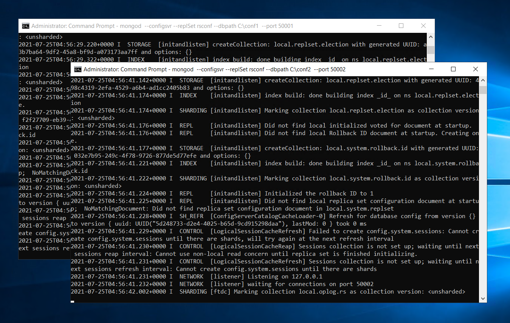

# 2. MongoDB 서버 세팅

## Shard Server 구성

단일 mongod 서버 3개 디렉토리 생성\(CMD\)

```
C:\> mkdir mongod1
C:\> mkdir mongod2
C:\> mkdir mongod3
```

생성한 디렉토리에 mongod 서버 실행

```bash
mongod --shardsvr --dbpath C:\mongod1 --port 30001
mongod --shardsvr --dbpath C:\mongod2 --port 30002
mongod --shardsvr --dbpath C:\mongod3 --port 30003
```


서버 1대당 1개 CMD창을 띄우고 실행, 총 CMD창 3개 실행



위와 같이 서버 3대가 실행됨

## Config Server 구성

단일 config 서버 2개 디렉토리 생성\(CMD\)

```bash
C:\> mkdir conf1
C:\> mkdir conf2
```

생성한 디렉토리에 config 서버 실행 

```bash
mongod --configsvr --replSet rsconf --dbpath C:\conf1  --port 50001
mongod --configsvr --replSet rsconf --dbpath C:\conf2  --port 50002
```


config 서버는 replSet 옵션으로 replica set을 지정




### Config Server Replica Set 구성

새로운 CMD창을 띄우고 실행시킨 Config 서버중 하나에 접속

```bash
mongo --port 50001 ##접속 

> config = { _id : "rsconf" , members : [
                {_id : 0 , host : "localhost:50001"},
                {_id : 1 , host : "localhost:50002"}
            ]} 

#위의 config 입력시 아래와 같이 출력
            
{
        "_id" : "rsconf",
        "members" : [
                {
                        "_id" : 0,
                        "host" : "localhost:50001"
                },
                {
                        "_id" : 1,
                        "host" : "localhost:50002"
                }
        ]
}            
            
> rs.initiate(config) #입력한 config 내용으로 초기값 세팅

#아래와 같이 출력됨
{
        "ok" : 1,
        "$gleStats" : {
                "lastOpTime" : Timestamp(1627190039, 1),
                "electionId" : ObjectId("000000000000000000000000")
        },
        "lastCommittedOpTime" : Timestamp(0, 0)
}
rsconf:SECONDARY>

```

위와 같이 출력되면 정상,  replica set 상태는 rs.status\(\)로 확인

```bash
rsconf:PRIMARY>rs.status()
{
        "set" : "rsconf",
        "date" : ISODate("2021-07-25T05:14:58.871Z"),
        "myState" : 1,
        "term" : NumberLong(1),
        "syncingTo" : "",
        "syncSourceHost" : "",
        "syncSourceId" : -1,
        "configsvr" : true,
        "heartbeatIntervalMillis" : NumberLong(2000),
        "majorityVoteCount" : 2,
        "writeMajorityCount" : 2,
        "optimes" : {
                "lastCommittedOpTime" : {
                        "ts" : Timestamp(1627190091, 1),
                        "t" : NumberLong(1)
                },
                "lastCommittedWallTime" : ISODate("2021-07-25T05:14:51.553Z"),
                "readConcernMajorityOpTime" : {
                        "ts" : Timestamp(1627190091, 1),
                        "t" : NumberLong(1)
                },
                "readConcernMajorityWallTime" : ISODate("2021-07-25T05:14:51.553Z"),
                "appliedOpTime" : {
                        "ts" : Timestamp(1627190091, 1),
                        "t" : NumberLong(1)
                },
                "durableOpTime" : {
                        "ts" : Timestamp(1627190091, 1),
                        "t" : NumberLong(1)
                },
                "lastAppliedWallTime" : ISODate("2021-07-25T05:14:51.553Z"),
                "lastDurableWallTime" : ISODate("2021-07-25T05:14:51.553Z")
        },
        "lastStableRecoveryTimestamp" : Timestamp(1627190050, 4),
        "lastStableCheckpointTimestamp" : Timestamp(1627190050, 4),
        "electionCandidateMetrics" : {
                "lastElectionReason" : "electionTimeout",
                "lastElectionDate" : ISODate("2021-07-25T05:14:10.427Z"),
                "electionTerm" : NumberLong(1),
                "lastCommittedOpTimeAtElection" : {
                        "ts" : Timestamp(0, 0),
                        "t" : NumberLong(-1)
                },
                "lastSeenOpTimeAtElection" : {
                        "ts" : Timestamp(1627190039, 1),
                        "t" : NumberLong(-1)
                },
                "numVotesNeeded" : 2,
                "priorityAtElection" : 1,
                "electionTimeoutMillis" : NumberLong(10000),
                "numCatchUpOps" : NumberLong(0),
                "newTermStartDate" : ISODate("2021-07-25T05:14:10.511Z"),
                "wMajorityWriteAvailabilityDate" : ISODate("2021-07-25T05:14:11.652Z")
        },
        "members" : [
                {
                        "_id" : 0,
                        "name" : "localhost:50001",
                        "health" : 1,
                        "state" : 1,
                        "stateStr" : "PRIMARY",
                        "uptime" : 1111,
                        "optime" : {
                                "ts" : Timestamp(1627190091, 1),
                                "t" : NumberLong(1)
                        },
                        "optimeDate" : ISODate("2021-07-25T05:14:51Z"),
                        "syncingTo" : "",
                        "syncSourceHost" : "",
                        "syncSourceId" : -1,
                        "infoMessage" : "could not find member to sync from",
                        "electionTime" : Timestamp(1627190050, 1),
                        "electionDate" : ISODate("2021-07-25T05:14:10Z"),
                        "configVersion" : 1,
                        "self" : true,
                        "lastHeartbeatMessage" : ""
                },
                {
                        "_id" : 1,
                        "name" : "localhost:50002",
                        "health" : 1,
                        "state" : 2,
                        "stateStr" : "SECONDARY",
                        "uptime" : 59,
                        "optime" : {
                                "ts" : Timestamp(1627190091, 1),
                                "t" : NumberLong(1)
                        },
                        "optimeDurable" : {
                                "ts" : Timestamp(1627190091, 1),
                                "t" : NumberLong(1)
                        },
                        "optimeDate" : ISODate("2021-07-25T05:14:51Z"),
                        "optimeDurableDate" : ISODate("2021-07-25T05:14:51Z"),
                        "lastHeartbeat" : ISODate("2021-07-25T05:14:58.470Z"),
                        "lastHeartbeatRecv" : ISODate("2021-07-25T05:14:57.262Z"),
                        "pingMs" : NumberLong(0),
                        "lastHeartbeatMessage" : "",
                        "syncingTo" : "localhost:50001",
                        "syncSourceHost" : "localhost:50001",
                        "syncSourceId" : 0,
                        "infoMessage" : "",
                        "configVersion" : 1
                }
        ],
        "ok" : 1,
        "$gleStats" : {
                "lastOpTime" : Timestamp(1627190039, 1),
                "electionId" : ObjectId("7fffffff0000000000000001")
        },
        "lastCommittedOpTime" : Timestamp(1627190091, 1),
        "$clusterTime" : {
                "clusterTime" : Timestamp(1627190091, 1),
                "signature" : {
                        "hash" : BinData(0,"AAAAAAAAAAAAAAAAAAAAAAAAAAA="),
                        "keyId" : NumberLong(0)
                }
        },
        "operationTime" : Timestamp(1627190091, 1)
}
```

## Router Server 구성\(mongos\)

새 CMD창을 띄우고 mongos 서버를 실행

```bash
mongos --configdb rsconf/localhost:50001,localhost:50002 --port 60001
```

### mongos 서버 접속 

새 CMD 창을 띄우고 mongos 서버에 접속

```bash
> mongo --port 60001

#mongos 서버 접속시 아래와같이 mongos로 표시
mongos> 

#sh.status()로 샤딩전 상태 확인 
mongos> sh.status()
--- Sharding Status ---
  sharding version: {
        "_id" : 1,
        "minCompatibleVersion" : 5,
        "currentVersion" : 6,
        "clusterId" : ObjectId("60fcf3231e2350cd9dcce677")
  }
  shards:
  active mongoses:
  autosplit:
        Currently enabled: yes
  balancer:
        Currently enabled:  yes
        Currently running:  no
        Failed balancer rounds in last 5 attempts:  0
        Migration Results for the last 24 hours:
                No recent migrations
  databases:
        {  "_id" : "config",  "primary" : "config",  "partitioned" : true }


```

