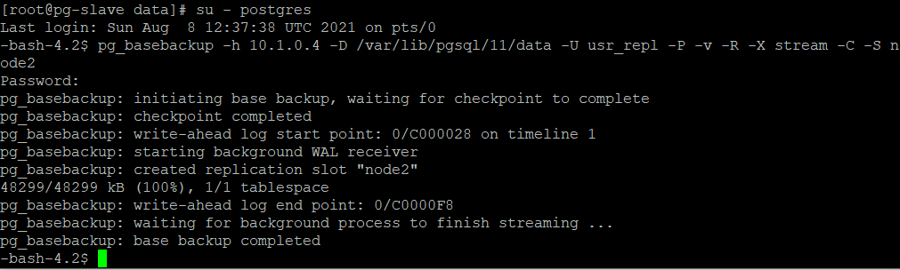

# 3. Config 설정

## pg-master configure 설정 

Postgres 계정 비밀번호 설정 

```text
[root@pg-master clooadmin]# su - postgres
-bash-4.2$ psql
psql (11.12)
Type "help" for help.

postgres=# \password postgres
Enter new password: 패스워드 
Enter it again: 패스워드 
postgres=#
```

Replication 유저 생성 

```text
postgres=# create role usr_repl with replication password 'replica' login;
CREATE ROLE
```

postgresql.conf 파일 수정 

```text
vi /var/lib/pgsql/11/data/postgresql.conf 

linten_addresses = '*' 
wal_level = hot_standby # 대기 서버에서 읽기 전용 작업 가능 
max_wal_senders = 2 # WAL 파일을 전송할 수 있는 최대 서버 수 
wal_keep_segments = 32 # 마스터 서버 디렉토리에 저장할 최대 WAL 파일 수  
```

pg\_hba.conf 파일 수정 

```text
vi /var/lib/pgsql/11/data/pg_hba.conf
#아래 replciation 유저 추가 
host  replication   usr_repl    10.1.0.5/32   md5 

# 외부 접속 허용시 ip 주소 추가 후 Azure NSG에 5432 인바운드 포트 오픈 
```

서버 재시작 

```text
systemctl restart postgresql-11 # config 파일 잘못 수정하면 재시작 오류 발생할 수 있음 
```

sampledb 복원 

```text
psql -h hostname/ip -U postgres sampledb < d:\sampledb.sql
```

## pg-slave configure 설정 

Postgres 계정 비밀번호 설정 

```text
[root@pg-master clooadmin]# su - postgres
-bash-4.2$ psql
psql (11.12)
Type "help" for help.

postgres=# \password postgres
Enter new password: 패스워드 
Enter it again: 패스워드 
postgres=#
```

pg-slave 중지 

```text
systemctl stop postgresql-11
```

postgres로 유 변경 

```text
su - postgres 
```

pg-slave 데이터 백업 

```text
cp -R /var/lib/pgsql/11/data /var/lib/pgsql/11/standby_bak 
```

pg-slave 데이터 삭제 

```text
rm -rf /var/lib/pgsql/11/data/* 
```

pg\_basebackup 

```text
pg_basebackup -h 10.1.0.4 -D /var/lib/pgsql/11/data -U usr_repl -P -v -X stream
```



pg\_basebackup 옵션중 복제 슬롯이 있음, 버전마다 확인 필요   
여기서는 복제 슬롯없이 진행함 


postgresql.conf 설정 

```text
# 대기 서버에서 읽기전용 작업 가능 
hot_standby = on 
```


pg\_basebackup시 data 파일이 모두 복제 되므로 master에서의 구성 파일이 그대로 복제됨 


failover\_trigger 폴더 생성 

```text
mkdir /var/lib/pgsql/11/failover_trigger 
```

recovery.conf 파일 생성 

```text
vi /var/lib/pgsql/11/data/recovery.conf 

standby_mode = on # 읽기 전용 작업 
primary_conninfo = 'host=10.1.0.4 port=5432 user=usr_repl password=replica' # 연결정보 
trigger_file = '/var/lib/pgsql/11/failover_trigger' # failover 트리거 파일 경로 

#위 내용 입력 
```

pg-slave 실행 

```text
systemctl start postgresql-11 
```

아래와 같이 recovery.done으로 바뀜 



## 데이터 확인 

pg-master의 sampledb 테이블 카운트 


pg-slave에 sampledb 테이블 카운트 



Replication을 맺고 pg\_stats의 통계 때문인지 카운트가 다 0으로 출력..   
실제 테이블 카운트 조회시 정상적으로 카운팅 됨 


analyze 변수 없이 실행하면 현재 세션의 database의 모든 테이에 대해 통계 업데이트  


  


