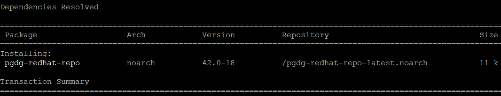
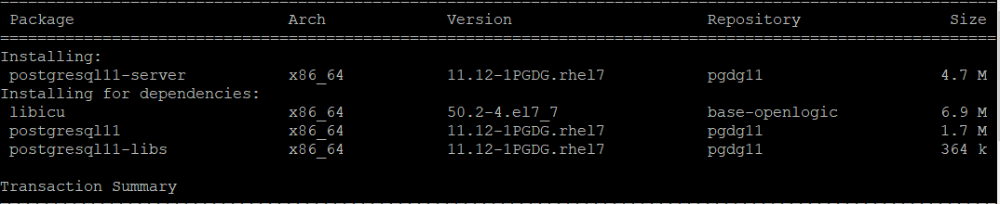
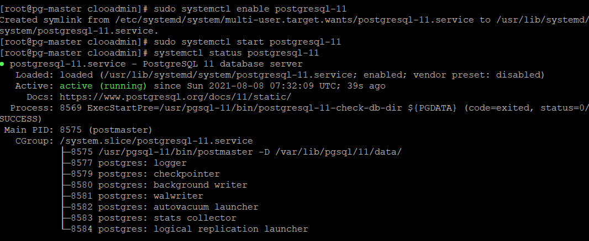

# 2. PostgreSQL 11 설치

## RPM 다운로드 

PostgreSQL 홈페이지에 RPM 다운로드 스크립트를 제공 해줌 

```bash
sudo yum install -y https://download.postgresql.org/pub/repos/yum/reporpms/EL-7-x86_64/pgdg-redhat-repo-latest.noarch.rpm
```



## YUM 설치 

```bash
sudo yum install -y postgresql11-server
```



## PostgreSQL 11 DB 초기화 

```bash
sudo /usr/pgsql-11/bin/postgresql-11-setup initdb
```

## PostgreSQL 11 enable 

```bash
sudo systemctl enable postgresql-11
```

## PostgreSQL 11 start 

```bash
sudo systemctl start postgresql-11
```



