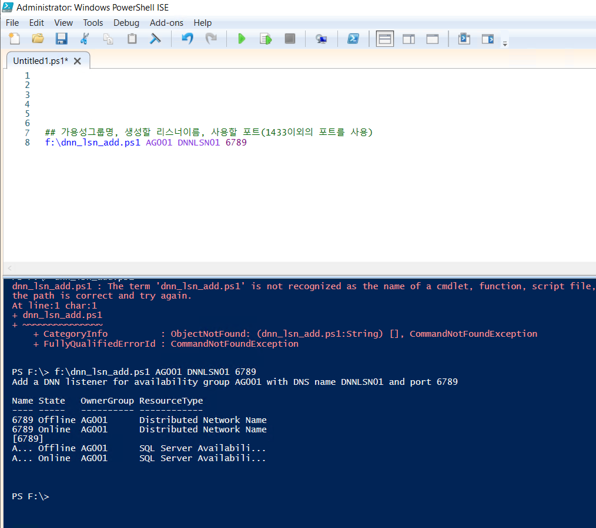
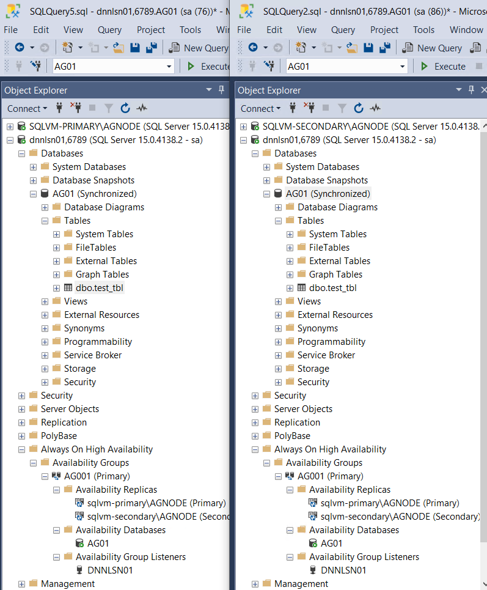
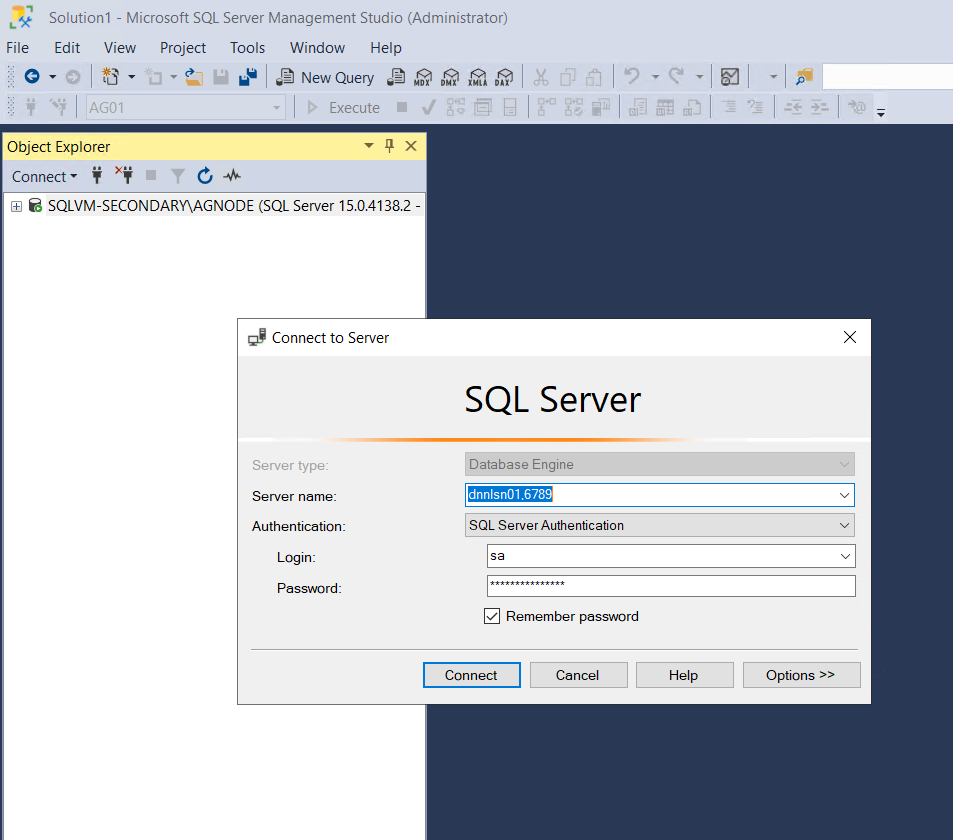
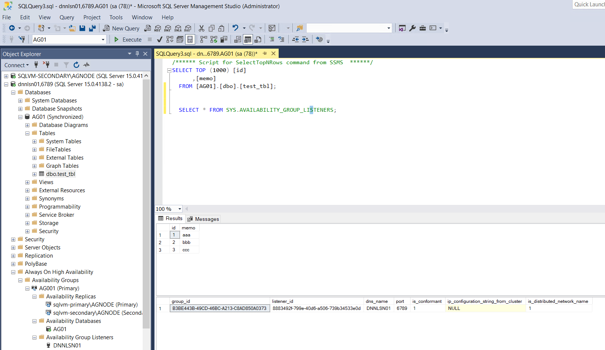
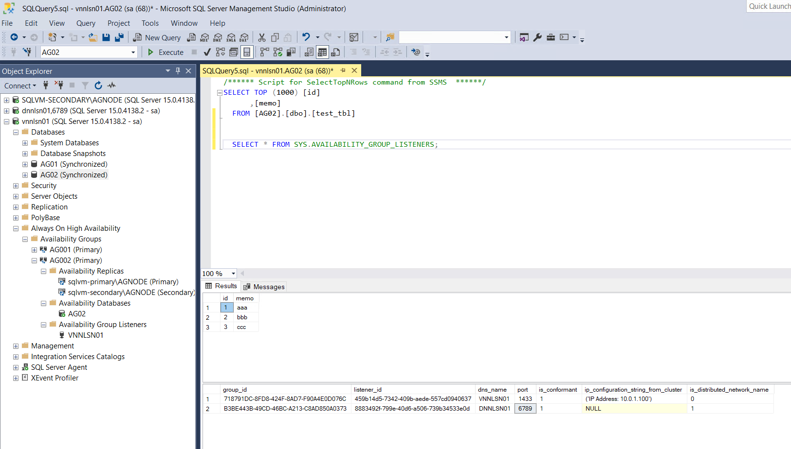

# 7. Load Balancer 구성

## DNN 리스너 생성  

dnn\_lsn\_add.ps1 파일로 저장 

```
param (
   [Parameter(Mandatory=$true)][string]$Ag,
   [Parameter(Mandatory=$true)][string]$Dns,
   [Parameter(Mandatory=$true)][string]$Port
)

Write-Host "Add a DNN listener for availability group $Ag with DNS name $Dns and port $Port"

$ErrorActionPreference = "Stop"

# create the DNN resource with the port as the resource name
Add-ClusterResource -Name $Port -ResourceType "Distributed Network Name" -Group $Ag 

# set the DNS name of the DNN resource
Get-ClusterResource -Name $Port | Set-ClusterParameter -Name DnsName -Value $Dns 

# start the DNN resource
Start-ClusterResource -Name $Port


$Dep = Get-ClusterResourceDependency -Resource $Ag
if ( $Dep.DependencyExpression -match '\s*\((.*)\)\s*' )
{
$DepStr = "$($Matches.1) or [$Port]"
}
else
{
$DepStr = "[$Port]"
}

Write-Host "$DepStr"

# add the Dependency from availability group resource to the DNN resource
Set-ClusterResourceDependency -Resource $Ag -Dependency "$DepStr"


#bounce the AG resource
Stop-ClusterResource -Name $Ag
Start-ClusterResource -Name $Ag
```

저장한 파일을 Powershell로 변수 추가하여 실행  




DNN 리스너를 사용할 경우 기존 1433 포트 사용 X, 사용하지 않는 포트를 사용해야 함 


아래와 같이 DNN 리스너가 생성됨 




DNN 리스너를 생성할때 포트를 6789로 설정, 두 서버에 6789 포트를 열어주어야 함 





DNN 리스너 접속시 리스너명과 , 포트 명시하여 접속


SQLVM-SECONDARY 서버 접속 후 리스너를 통한 접속 화면  




기존 리스너 VNN 방식일 경우 Load Balancer 없이 접속이 불가함   
DNN의 경우 리스너 생성 후 Load Banlancer 없이 접속이 바로 가능함 


```text
-- 리스너 속성 확인 
SELECT * FROM SYS.AVAILABILITY_GROUP_LISTENERS; 
```

## VNN 리스너 생성 




DNN과 VNN 모두 사용할 수 있음 \(VNN 구성시 LB 구성하면 접속 됨\) 


  


