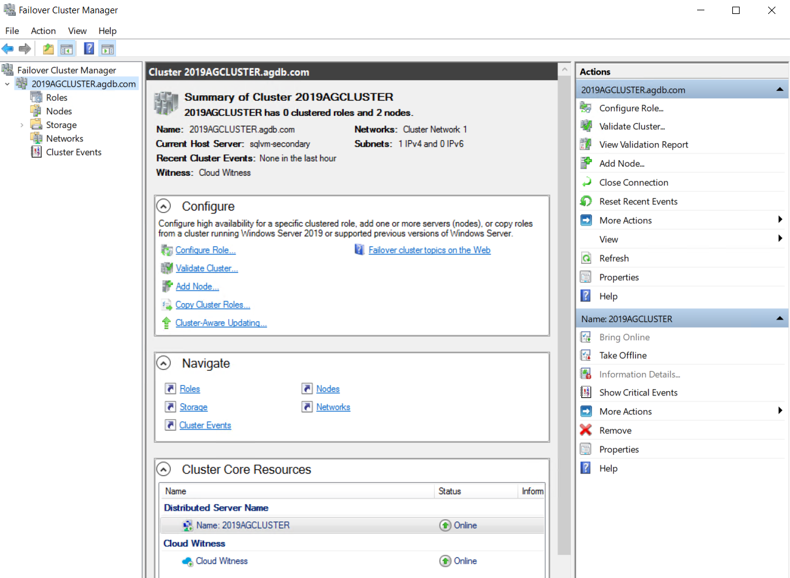
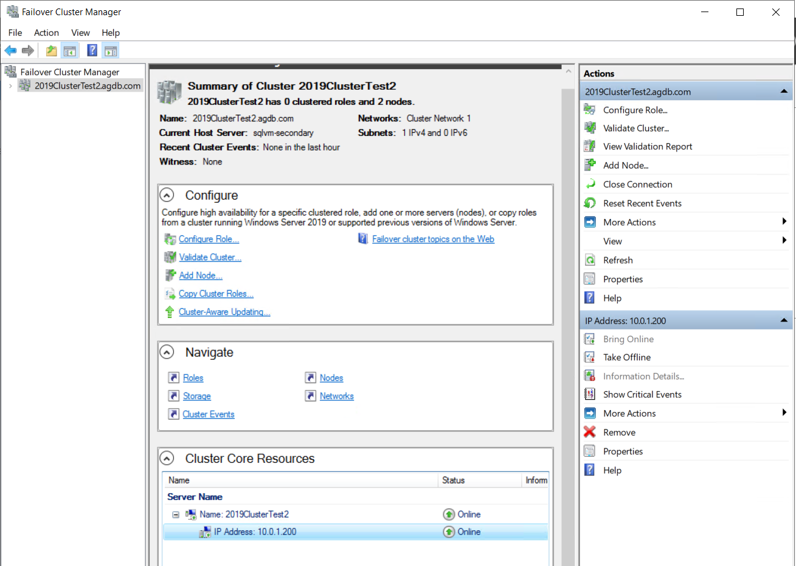
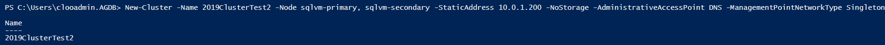

# 4. Failover Cluster 구성

## SQL Server 2019 ver Cluster 생성 

SQL Server 2016과 차이점 




클러스터 생성 마법사\(GUI\)로 생성시 Distributed Server Name\(DNN\)으로 기본 생성됨  
 DNN의 경우 2016 버전과 다르게 지정된 IP 설정이 안됨 



쿼럼 생성시\(Cloud Witness\) 2016 버전과 다르게 TLS 1.2 오류가 없었음 


## Cluster 생성시 IP 지정 방법 

GUI 또는 Powershell로 기존 구문인 일반 static ip 만 지정시 DNN으로 클러스터가 생성됨 



```text
New-Cluster -Name 2019ClusterTest2 -Node sqlvm-primary, sqlvm-secondary -StaticAddress 10.0.1.200 -NoStorage -AdministrativeAccessPoint DNS -ManagementPointNetworkType Singleton
```




위와 같이 -ManagementPointNetworkType Singleton 옵션을 지정하면 기존 방식으로 IP를 지정할 수 있음 



