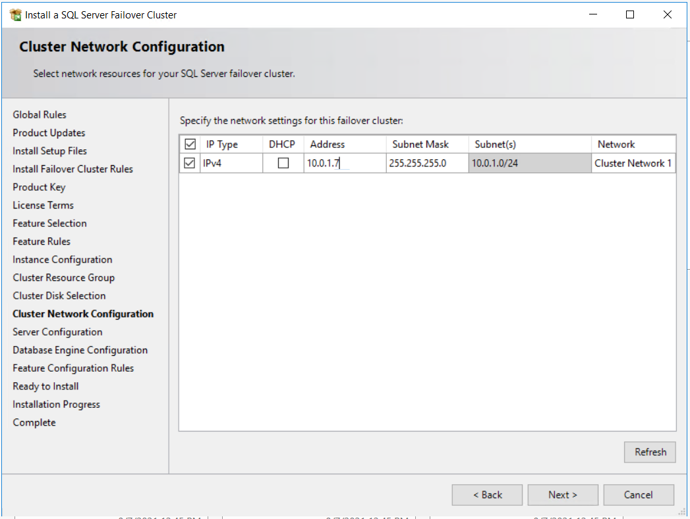
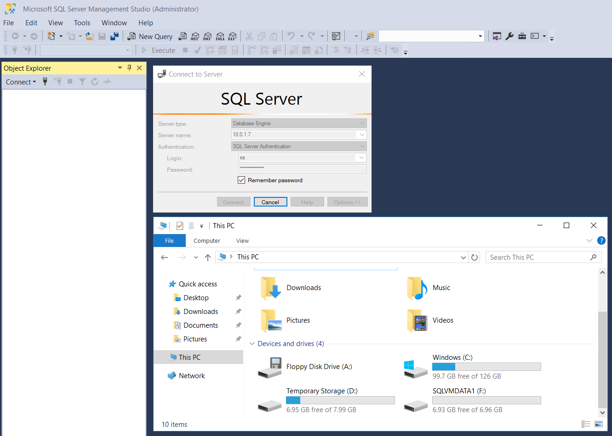

# 7. SQL Server FCI 설치

## SQLVM-PRIMARY에 SQL Server Failover Cluster 새로 설치 

New SQL Server failover cluster installation 클릭 

네트워크 이름과 인스턴스명 입력 

클러스터 리소스 그룹에 관한 내용인데 다음으로 넘어감 

클러스터에 추가한 공유 디스크 선택 

DHCP 체크를 해제하고 static IP로 지정 10.0.1.7 

SQL Server 계정 설정 

SQL Server 데이터 디렉토리 지정 


SQL Server 설치 전 클러스터\(WSFC\)에 추가한 공유 디스크\(FCIDisk\) G 드라이브 



테스트에서는 공유 디스크를 1개만 추가하여 Data, Log, Backup 한 드라이브에 지정 했으나  
실제 프로젝트 환경에서는 Data, Log, Backup 스토리지를 분리하여 진행함   
\(공유 디스크만 추가하면 됨\) 


Install 

## SQLVM-SECONDARY에 SQL Server Failover Cluster 노드 추가 

Add node to a SQL Server failover cluster 클릭 

Install 

SQL Server 2016 Configure Manager 실행 후 1433 포트 확인 

## 설치 후 구성 확인 

SQLVM-PRIMARY 서버 접속 후 host 서버, 공유 디스크를 볼 수 있음 


SQLVM-PRIMARY, SQLVM-SECONDARY 서버 IP 10.0.1.4, 10.0.1.5 접속은 불가   
SQL Server 설치시 인스턴스 IP 10.0.1.7에만 접속 가능 


SQLVM-SECONDARY 접속 후 LB 구성 없이 접속 불가 


공유 디스크가 SQLVM-PRIMARY에 host 되어 SQLVM-SECONDARY는 보이지 않음   
\(Failover가 되어 SQLVM-SECONDARY로 host 되면 바뀌게 됨\) 


  

