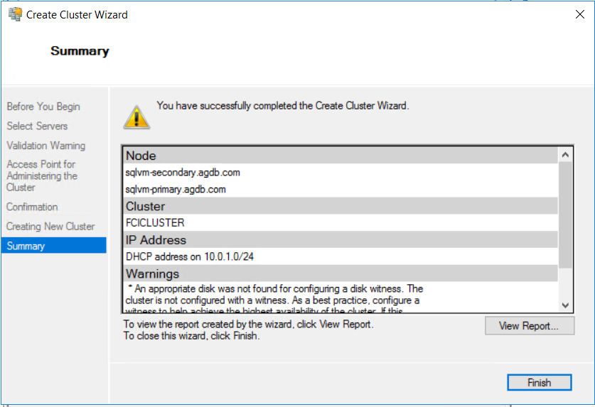

# 5. Failover Cluster 구성

## FCI Cluster 생성 

GUI로 클러스터 생성 AlwaysOn 그룹과 동일 



```text
## Windows Server 2012-2016 
New-Cluster -Name <FailoverCluster-Name> -Node ("<node1>","<node2>") –StaticAddress <n.n.n.n> -NoStorage

## Windwos Server 2019
New-Cluster -Name <FailoverCluster-Name> -Node ("<node1>","<node2>") –StaticAddress <n.n.n.n> -NoStorage -ManagementPointNetworkType Singleton
```


Windows Server 2019시 Powershell로 IP 지정하여 생성 


