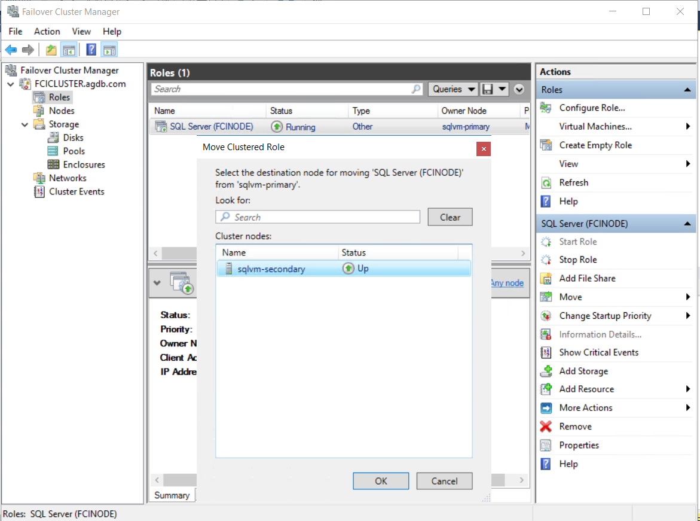
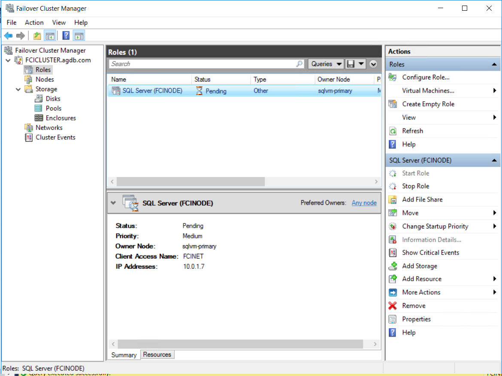
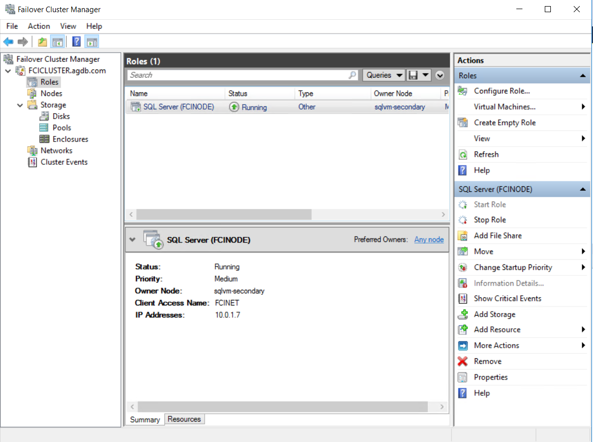
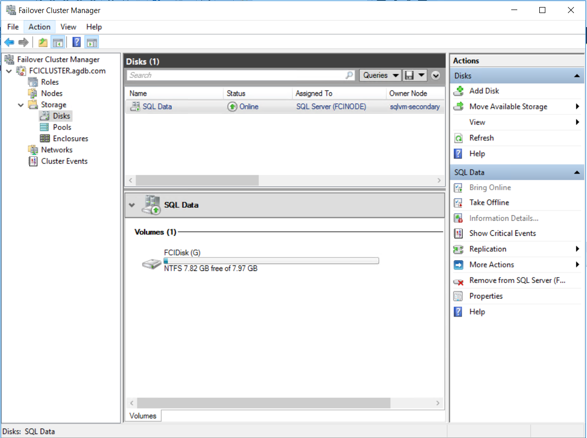
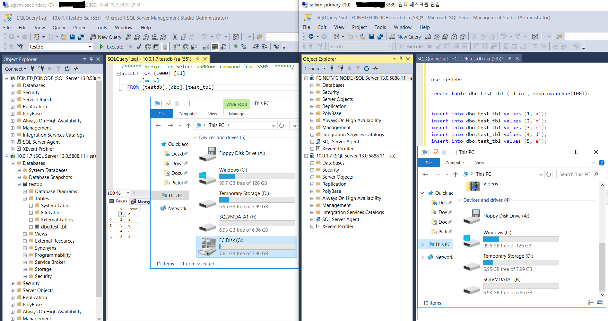

# 9. 수동 Failover

## Test Database 생성 

데이터 입력 

```sql
use testdb;

create table dbo.test_tbl (id int, memo nvarchar(100));


insert into dbo.test_tbl values (1,'a');
insert into dbo.test_tbl values (2,'b');
insert into dbo.test_tbl values (3,'c');
insert into dbo.test_tbl values (4,'d');
insert into dbo.test_tbl values (5,'e');


select * from test_tbl;

/**
1	a
2	b
3	c
4	d
5	e
**/
```

## 수동 Failover 











Role과 Disk의 Owner가 SQLVM-SECONDARY로 바뀜 





수동 Failover 후 공유 디스크가 SQLVM-SECONDARY로 잡히며, 데이터 조회도 잘 됨 


