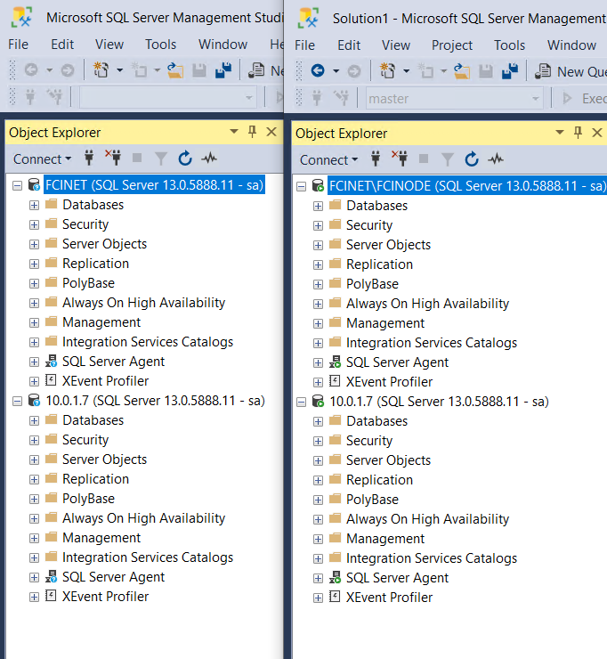

# 8. Load Banlancer 구성

## Azure Portal Load Balancer 배포 

AlwaysOn 가용성 그룹의 Load Balancer 배포와 동일하여 참고 


Load Balancer 생성시 Public IP SKU와 맞춰 줌 


프론트엔드 : 10.0.1.7 \(FCIINSTANCE\)  
백엔드 : SQLVM-PRIMARY, SQLVM-SECONDARY\(SQLVM\)  
상태프로브 : 59999\(HP59999\)  
부하분산규칙 : FCIRULE

## 클러스터 프로브 구성 

SQLVM-PRIMARY 서버에서 한번만 해주니 SQLVM-SECONDARY 서버에서 10.0.1.7 접속이 잘 됨 

```text
PS C:\Users\clooadmin.AGDB> Get-ClusterNetwork

Name              State Metric             Role
----              ----- ------             ----
Cluster Network 1    Up  69600 ClusterAndClient

PS C:\Users\clooadmin.AGDB> Get-ClusterResource

Name                       State   OwnerGroup           ResourceType    
----                       -----   ----------           ------------    
Cloud Witness              Online  Cluster Group        Cloud Witness   
Cluster IP Address         Online  Cluster Group        IP Address      
Cluster Name               Online  Cluster Group        Network Name    
SQL Data                   Online  SQL Server (FCINODE) Physical Disk   
SQL IP Address 1 (FCINET)  Online  SQL Server (FCINODE) IP Address      
SQL Network Name (FCINET)  Online  SQL Server (FCINODE) Network Name    
SQL Server (FCINODE)       Online  SQL Server (FCINODE) SQL Server      
SQL Server Agent (FCINODE) Online  SQL Server (FCINODE) SQL Server Agent
SQL Server CEIP (FCINODE)  Offline SQL Server (FCINODE) Generic Service 


PS C:\Users\clooadmin.AGDB> 

$ClusterNetworkName = "Cluster Network 1"
$IPResourceName = "SQL IP Address 1 (FCINET)" 
$ILBIP = "10.0.1.7" 
[int]$ProbePort = 59999

Import-Module FailoverClusters

Get-ClusterResource $IPResourceName | Set-ClusterParameter -Multiple @{"Address"="$ILBIP";"ProbePort"=$ProbePort;"SubnetMask"="255.255.255.255";"Network"="$ClusterNetworkName";"EnableDhcp"=0}


WARNING: The properties were stored, but not all changes will take effect until SQL IP Address 1 (FCINET) is taken offline and then online again.

```

구성 확인 

```text
PS C:\Users\clooadmin.AGDB> Get-ClusterResource $IPResourceName | Get-ClusterParameter

Object                    Name                  Value                Type    
------                    ----                  -----                ----    
SQL IP Address 1 (FCINET) Network               Cluster Network 1    String  
SQL IP Address 1 (FCINET) Address               10.0.1.7             String  
SQL IP Address 1 (FCINET) SubnetMask            255.255.255.255      String  
SQL IP Address 1 (FCINET) EnableNetBIOS         1                    UInt32  
SQL IP Address 1 (FCINET) OverrideAddressMatch  0                    UInt32  
SQL IP Address 1 (FCINET) EnableDhcp            0                    UInt32  
SQL IP Address 1 (FCINET) ProbePort             59999                UInt32  
SQL IP Address 1 (FCINET) ProbeFailureThreshold 0                    UInt32  
SQL IP Address 1 (FCINET) LeaseObtainedTime     1/1/0001 12:00:00 AM DateTime
SQL IP Address 1 (FCINET) LeaseExpiresTime      1/1/0001 12:00:00 AM DateTime
SQL IP Address 1 (FCINET) DhcpServer            255.255.255.255      String  
SQL IP Address 1 (FCINET) DhcpAddress           0.0.0.0              String  
SQL IP Address 1 (FCINET) DhcpSubnetMask        255.0.0.0            String  
```

접속 확인 



  


  


