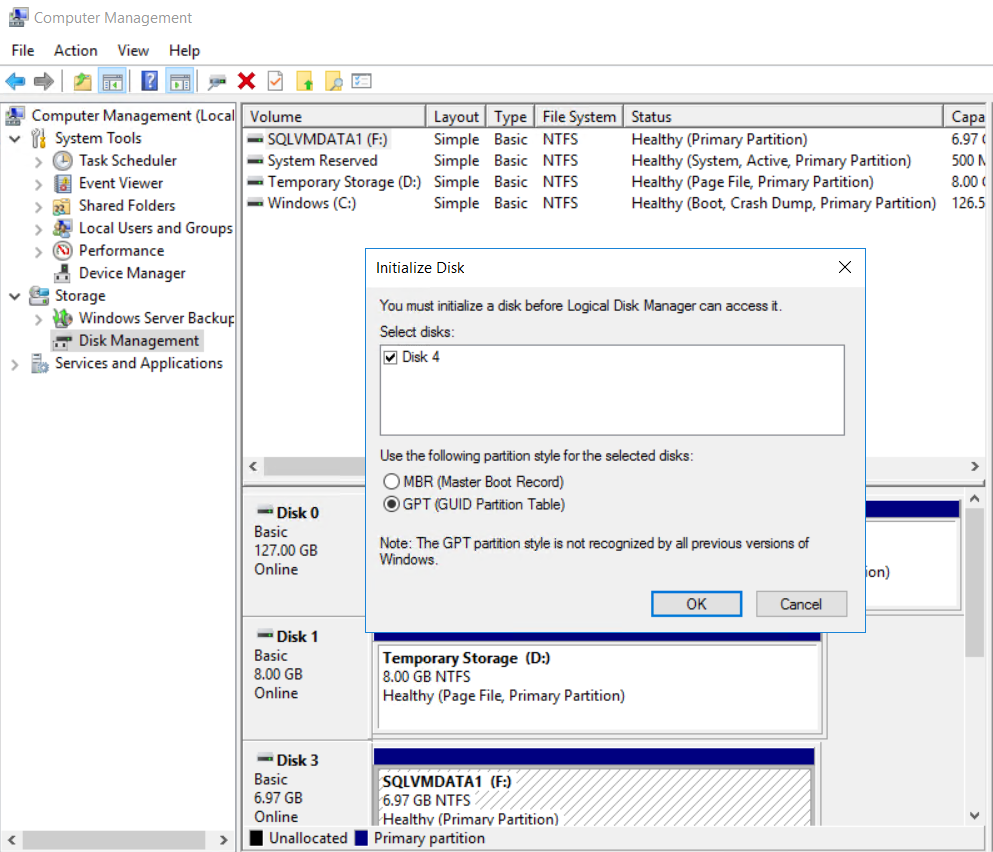

# 4. Azure 공유 디스크 마운트

## FCI용 Azure 공유 디스크 배포 

PowerShell을 이용한 FCIDisk 배포 

```
login-AzAccount -Tenant TenantID

$dataDiskConfig = New-AzDiskConfig -Location 'koreacentral' -DiskSizeGB 8 -AccountType Premium_LRS -CreateOption Empty -MaxSharesCount 2
New-AzDisk -ResourceGroupName 'alwayson' -DiskName 'FCIDisk' -Disk $dataDiskConfig

```

## 공유 디스크 마운트 

```text
##SQLVM-PRIMARY 

$vm = Get-AzVM -ResourceGroupName 'alwayson' -Name 'sqlvm-primary'
$dataDisk1 = Get-AzDisk -ResourceGroupName 'alwayson' -DiskName "FCIDisk"
Add-AzVMDataDisk -VM $vm -Name 'FCIDisk' -CreateOption Attach -ManagedDiskId $dataDisk1.Id -Lun 1
update-AzVm -VM $vm -ResourceGroupName 'alwayson'


##SQLVM-SECONDARY

$vm = Get-AzVM -ResourceGroupName 'alwayson' -Name 'sqlvm-secondary'
$dataDisk1 = Get-AzDisk -ResourceGroupName 'alwayson' -DiskName "FCIDisk"
Add-AzVMDataDisk -VM $vm -Name 'FCIDisk' -CreateOption Attach -ManagedDiskId $dataDisk1.Id -Lun 1
update-AzVm -VM $vm -ResourceGroupName 'alwayson'
```

### 공유 디스크 초기화 

SQLVM-PRIMARY와 SQLVM-SECONDARY 모두 GPT\(GUID\)로 초기화 




### 디스크 NTFS 포맷 


