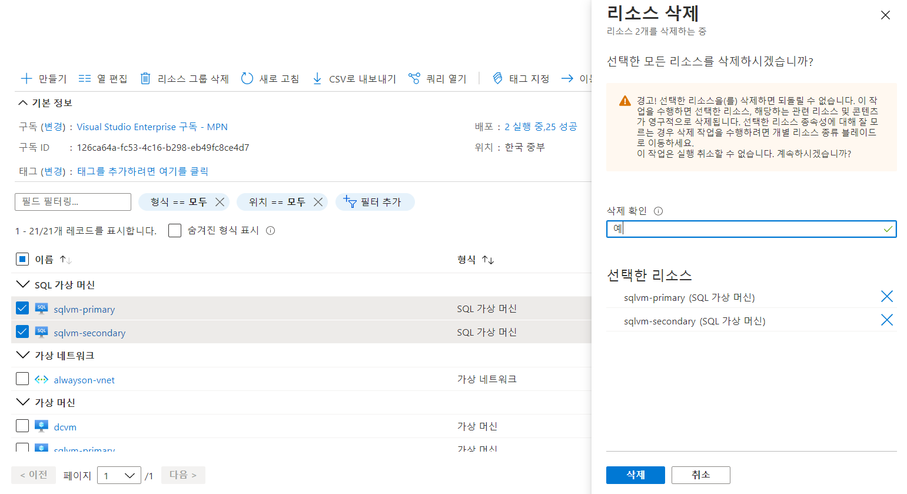
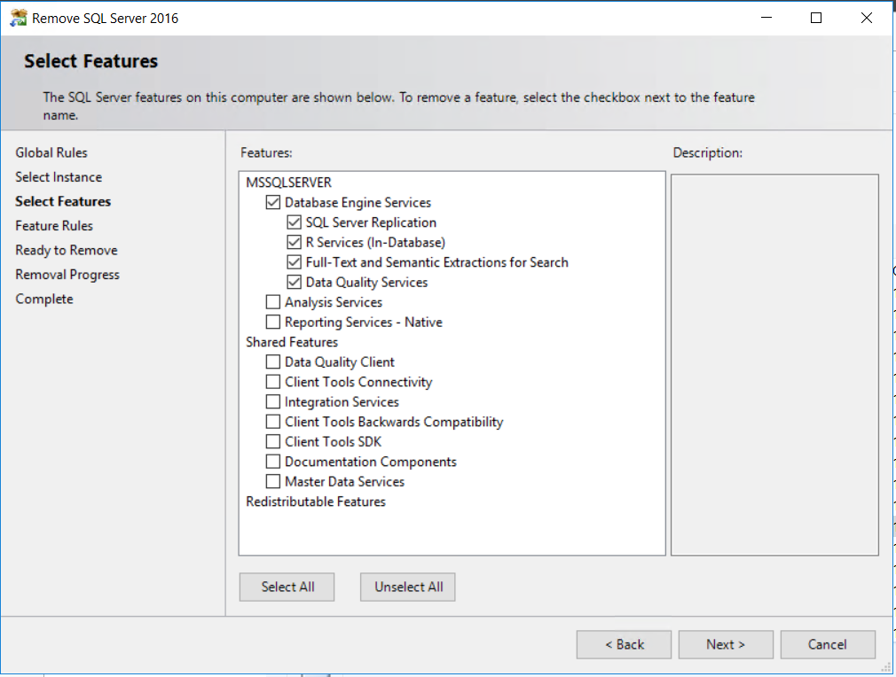
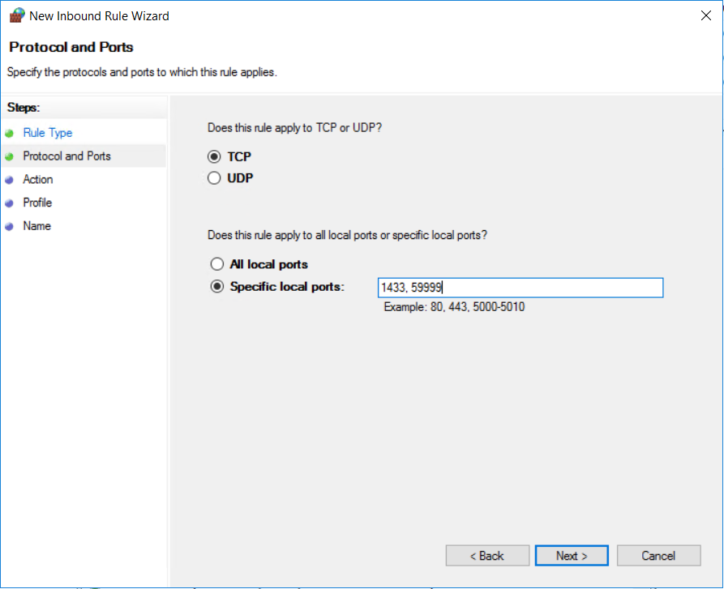
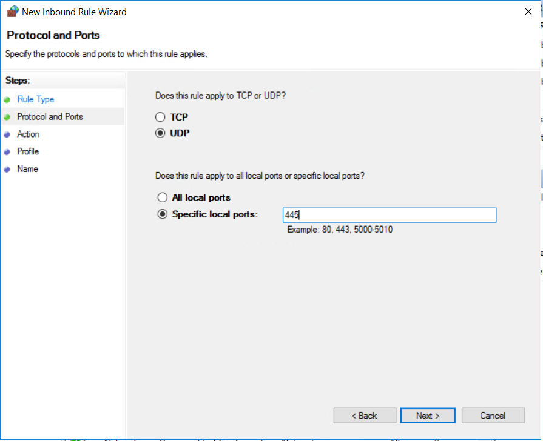

# 3. SQL Server 재설치

## SQL IaaS 확장 제거 

SQL 가상 머신을 배포한 경우 SQL Server 삭제 전 IaaS 확장 등록 취소 

## SQL Server 제거 

SQLVM-PRIMARY와 SQLVM-SECONDARY 모두 진행 

## 방화벽 오픈 

1433, 59999, 445 

## Failover Clustering Feature 설치 

