# 7. Load Balancer 구성

## Azure Load Balancer 생성 

먼저 SQLVM-PRIMARY와 SQLVM-SECONDARY 서버에서 접속 테스트 

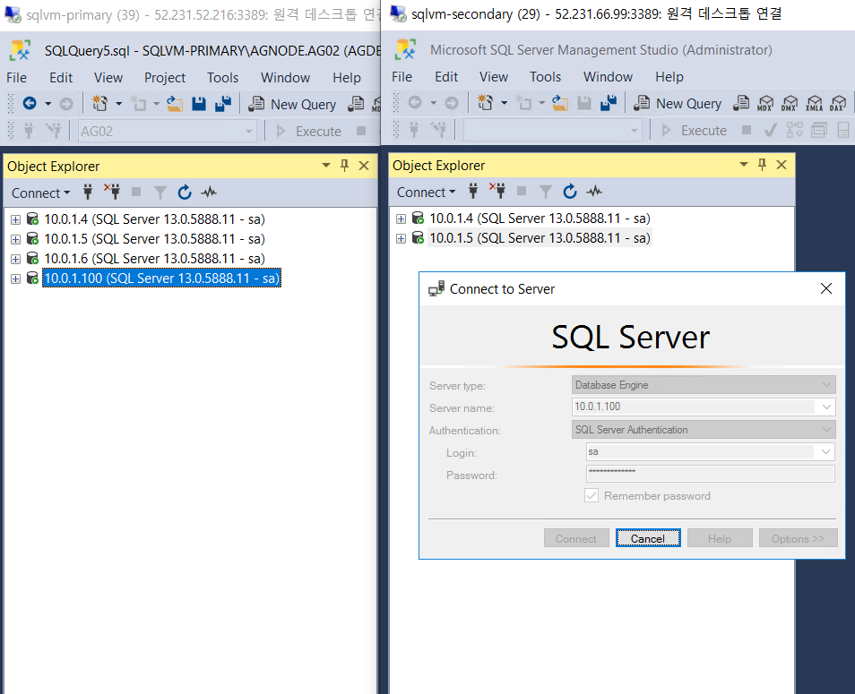


 SQLVM-PRIMARY서버에서는 클러스터 IP\(10.0.1.6\)와 리스너 IP\(10.0.1.100\)가  LB 구성없이   
접속이 잘 되지만, SQLVM-SECONDARY 서버에서는 접속이 안


Azure Portal 접속 후 LB 생성 

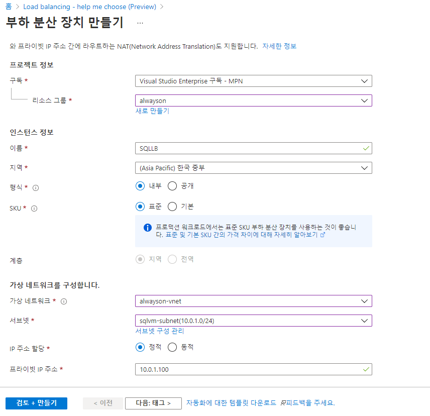


LB 생성시 SKU는 PIP의 SKU와 동일해야 해서 PIP와 같은 표준으로 생성


### LB의 Basic, Standard SKU 테스트 

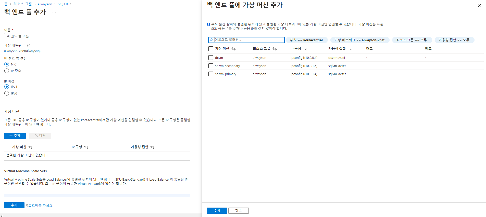


PIP와 같은 SKU인 표준으로 생성시 백엔드 풀에 가상 머신이 정상적으로 출력


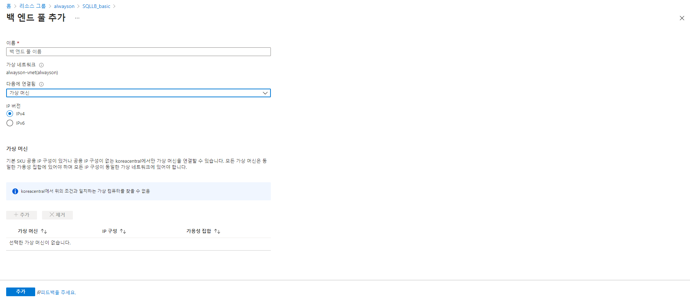


PIP와 다른 SKU인 기본으로 생성시 백엔트 풀에 가상 머신이 없다고 출력


프런트 엔드는 LB 생성시 입력한 리스너 IP로 생성되어 있음 

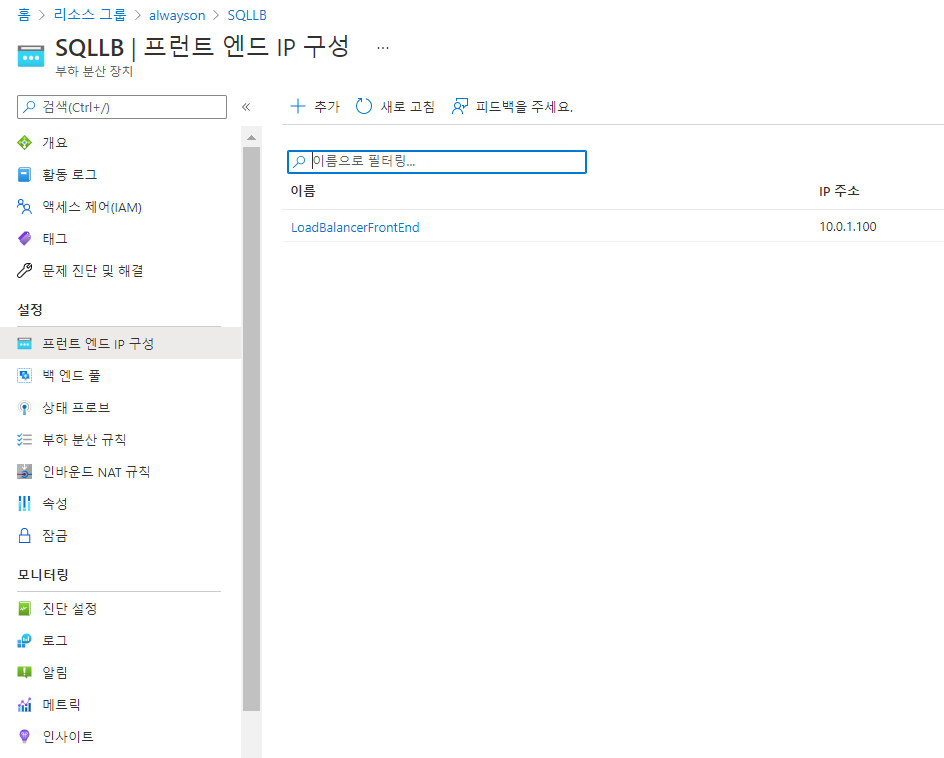

SQLVM-PRIMARY, SQLVM-SECONDARY 가상머신 백엔드 풀 추가 

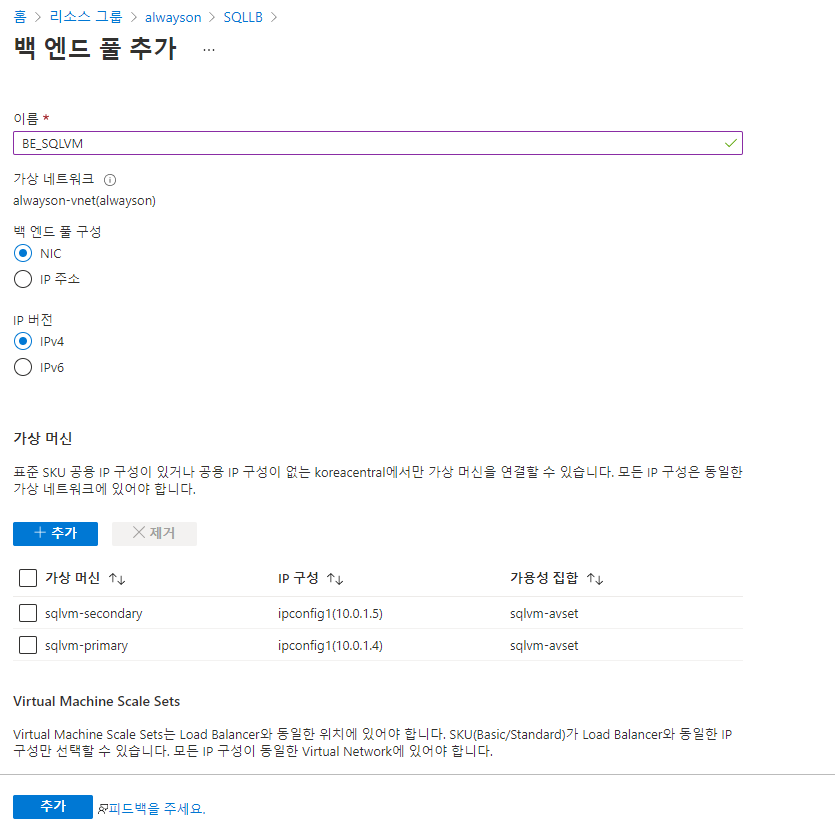

상태 프로브 설정 포트 59999

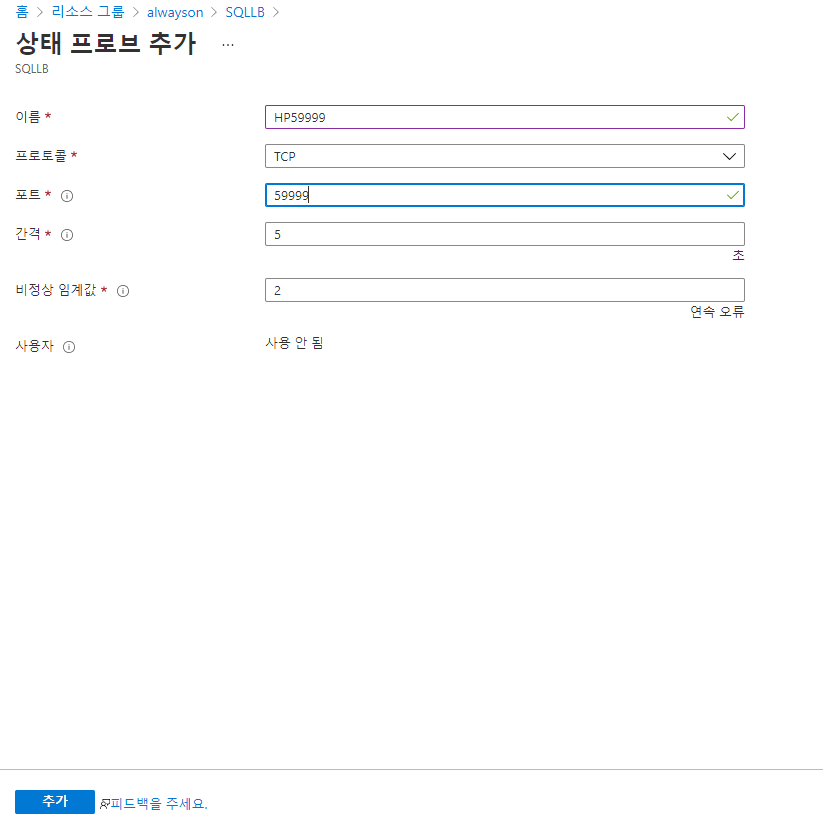

부하 분산 규칙 추가 

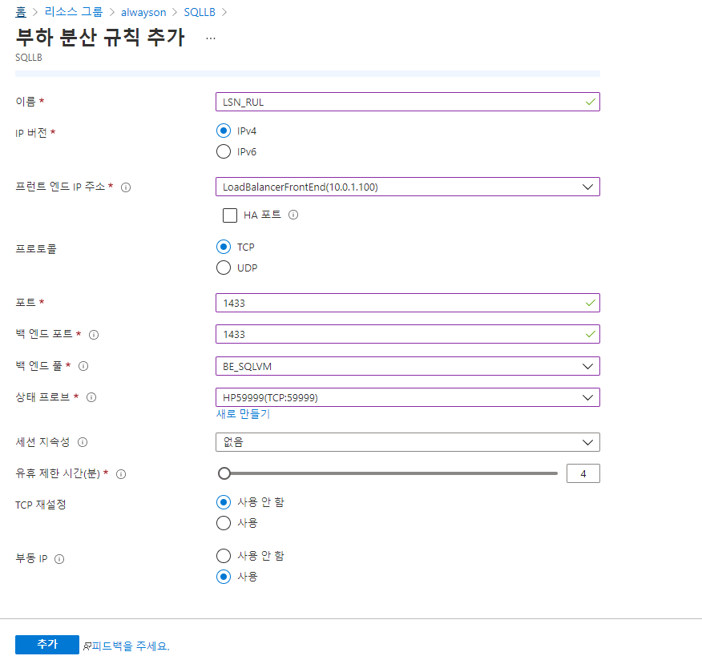

클러스터 IP에 대해 프런트 엔드 IP 추가

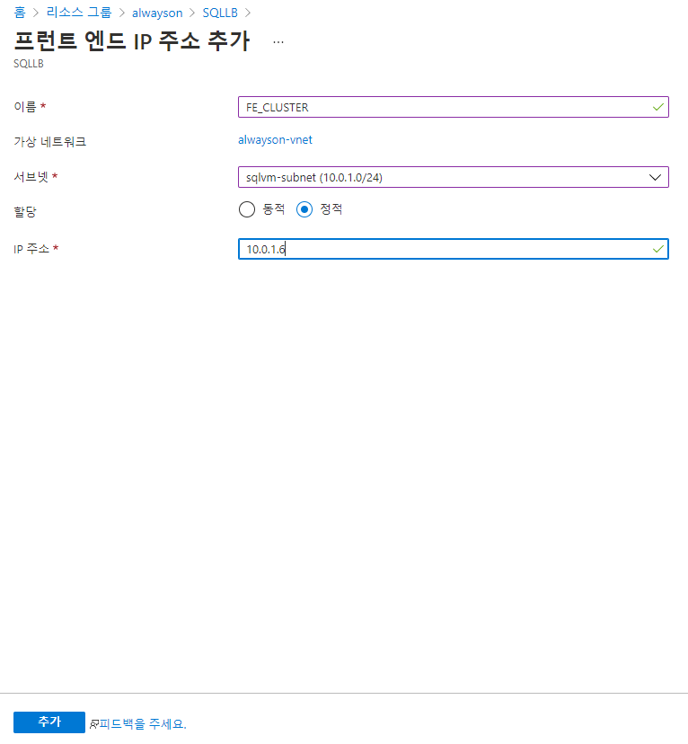

상태 프로브 포트 추가 

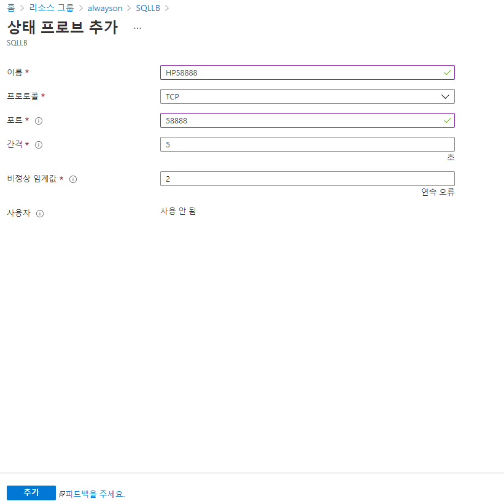

클러스터 IP 부하 분산 규칙 추가 

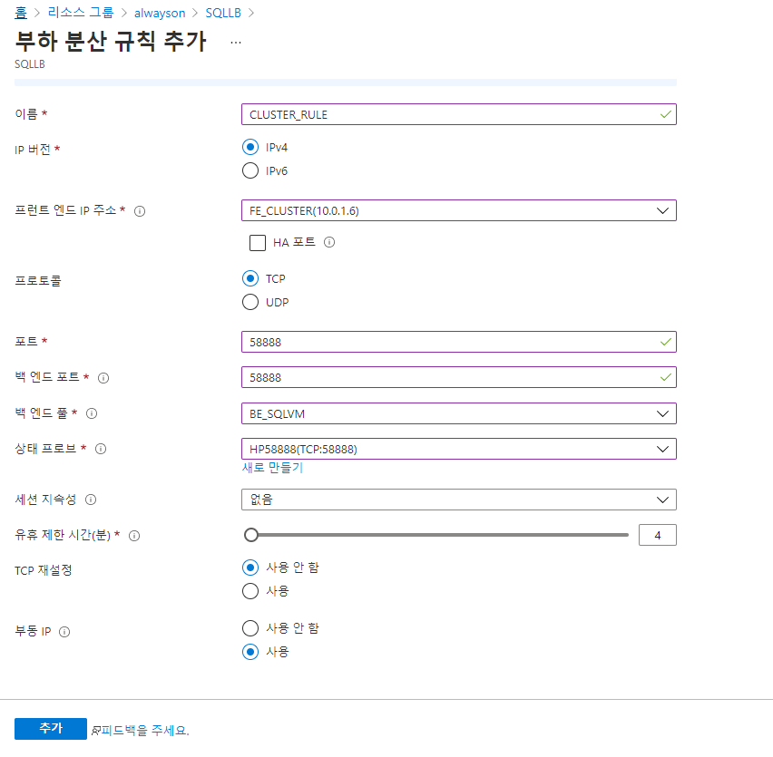

SQLVM-PRIMARY, SQLVM-SECONDARY 새로 추가된 포트 58888 방화벽 오픈 

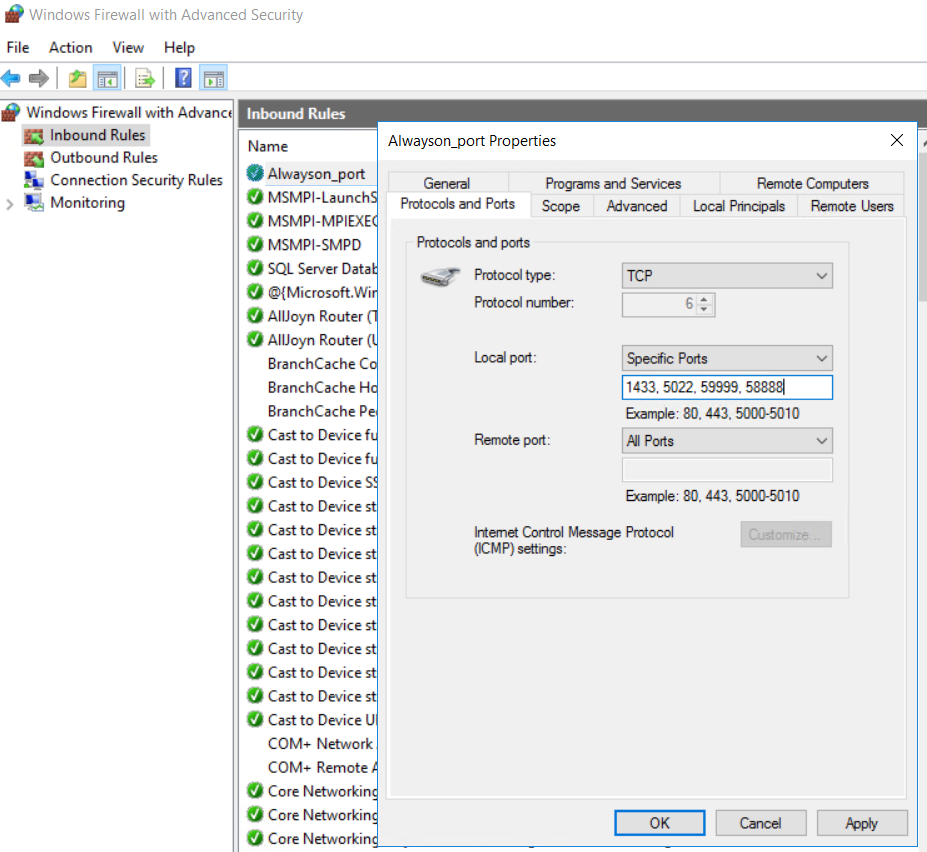

## 가용성 그룹 수신기 구성

먼저 가용성 그룹의 리스너 설정이 잘되어 있는지 확인 

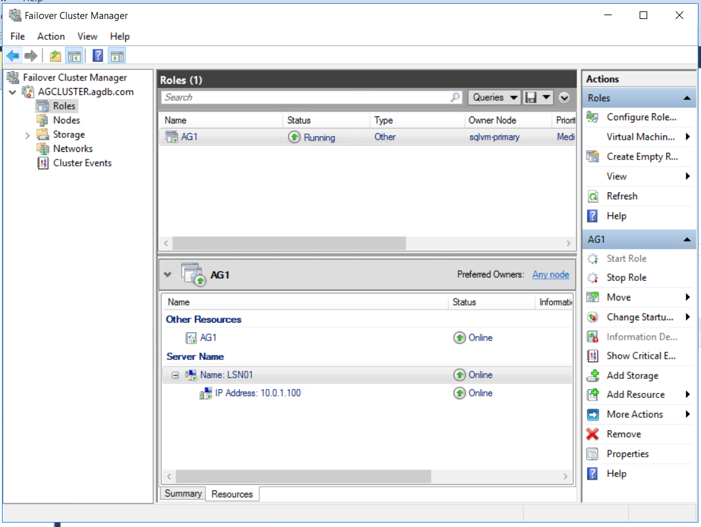


리스너 생성 없이 가용성 그룹을 생성했을 경우 리스너를 수동으로 생성 후 진행 


클러스터 네트워크 이름 확인 $ClusterNetworkName 변수에 사용 


IP 리소스 이름 확인 $IPResourceName 변수에 사

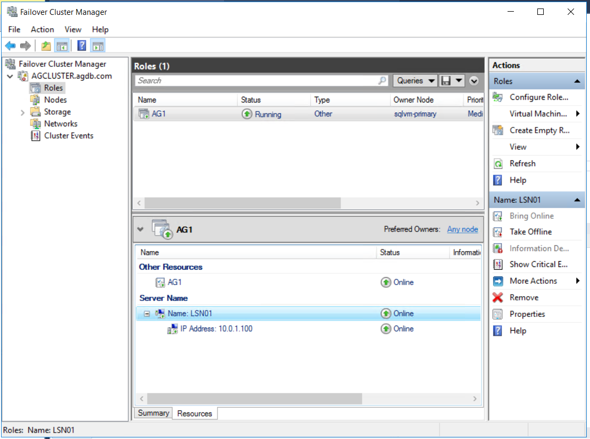

PowerShell 스크립트로 수신기 파라미터 세팅 

```text
Get-ClusterNetwork   ## -> Cluster Network 1 이름 확

PS C:\Users\clooadmin.AGDB> Get-ClusterNetwork

Name              State Metric             Role
----              ----- ------             ----
Cluster Network 1    Up  69600 ClusterAndClient
--------------------------------------------------------------
Get-ClusterResource  ## -> AG1_10.0.1.100, 10.0.1.100 확인 

PS C:\Users\clooadmin.AGDB> Get-ClusterResource

Name               State  OwnerGroup    ResourceType                 
----               -----  ----------    ------------                 
AG1                Online AG1           SQL Server Availability Group
AG1_10.0.1.100     Online AG1           IP Address                   
AG1_LSN01          Online AG1           Network Name                 
Cloud Witness      Online Cluster Group Cloud Witness                
Cluster IP Address Online Cluster Group IP Address                   
Cluster Name       Online Cluster Group Network Name    
--------------------------------------------------------------

$ClusterNetworkName = "Cluster Network 1" # the cluster network name (Use Get-ClusterNetwork on Windows Server 2012 of higher to find the name)
$IPResourceName = "AG1_10.0.1.100" # the IP Address resource name
$ListenerILBIP = "10.0.1.100" # the IP Address of the Internal Load Balancer (ILB). This is the static IP address for the load balancer you configured in the Azure portal.
[int]$ListenerProbePort = 59999

Import-Module FailoverClusters

Get-ClusterResource $IPResourceName | Set-ClusterParameter -Multiple @{"Address"="$ListenerILBIP";"ProbePort"=$ListenerProbePort;"SubnetMask"="255.255.255.255";"Network"="$ClusterNetworkName";"EnableDhcp"=0}


WARNING: The properties were stored, but not all changes will take effect until AG1_10.0.1.100 is taken offline and then online again.


```

```text
##오류 메세지 
PS C:\Users\clooadmin.AGDB> $ClusterNetworkName = "AG1_LSN01" # the cluster network name (Use Get-ClusterNetwork on Windows Server 2012 of higher to find the name)
$IPResourceName = "AG1_10.0.1.100" # the IP Address resource name
$ListenerILBIP = "10.0.1.100" # the IP Address of the Internal Load Balancer (ILB). This is the static IP address for the load balancer you configured in the Azure portal.
[int]$ListenerProbePort = 59999

Import-Module FailoverClusters

Get-ClusterResource $IPResourceName | Set-ClusterParameter -Multiple @{"Address"="$ListenerILBIP";"ProbePort"=$ListenerProbePort;"SubnetMask"="255.255.255.255";"Network"="$ClusterNetworkName";"EnableDhcp"=0}


Set-ClusterParameter : Unable to save property changes for 'AG1_10.0.1.100'.
    The cluster network was not found
At line:8 char:39
+ ... ourceName | Set-ClusterParameter -Multiple @{"Address"="$ListenerILBI ...
+                 ~~~~~~~~~~~~~~~~~~~~~~~~~~~~~~~~~~~~~~~~~~~~~~~~~~~~~~~~~
    + CategoryInfo          : NotSpecified: (:) [Set-ClusterParameter], ClusterCmdletException
    + FullyQualifiedErrorId : Set-ClusterParameter,Microsoft.FailoverClusters.PowerShell.SetClusterParameterCommand
```


$ClusterNetworkName 이름에 AG1\_LSN01 네트워크 이름이 아닌 Get-ClusterNetwork 해서 나온 Cluster Network 1 로 설정해야 함 \(테스트로 AG1\_LSN01로 해봤으나 에러\)


Failover Cluster Manager에서 Role 재시작 후 접속 확인 

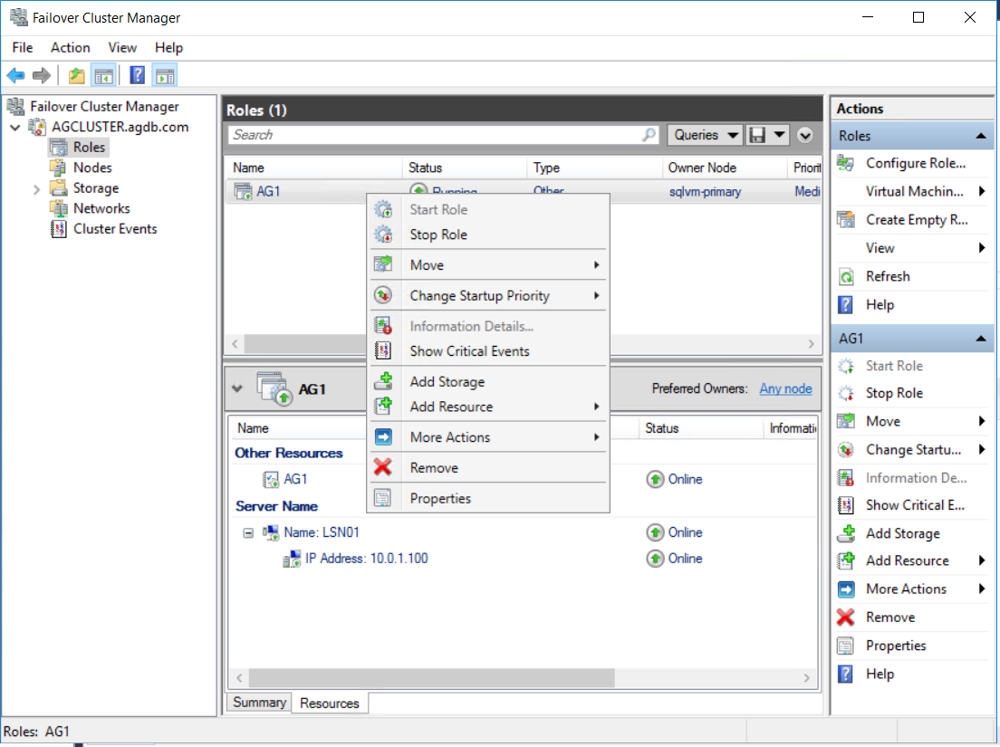

SQLVM-SECONDARY에서 정상적으로 접속 

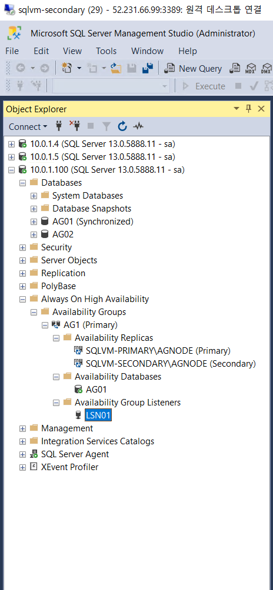

WSFC 클러스터 IP 파라미터 세팅 

```text

$ClusterNetworkName = "Cluster Network 1" # the cluster network name (Use Get-ClusterNetwork on Windows Server 2012 of higher to find the name)
$IPResourceName = "Cluster IP Address" # the IP Address resource name
$ClusterCoreIP = "10.0.1.6" # the IP Address of the Cluster IP resource. This is the static IP address for the load balancer you configured in the Azure portal.
[int]$ClusterProbePort = 58888 # The probe port from the WSFCEndPointprobe in the Azure portal. This port must be different from the probe port for the availability group listener probe port.

Import-Module FailoverClusters

Get-ClusterResource $IPResourceName | Set-ClusterParameter -Multiple @{"Address"="$ClusterCoreIP";"ProbePort"=$ClusterProbePort;"SubnetMask"="255.255.255.255";"Network"="$ClusterNetworkName";"EnableDhcp"=0}

WARNING: The properties were stored, but not all changes will take effect until Cluster IP Address is taken offline and then online ag
ain.
```

```text
## 오류 메세
PS C:\Users\clooadmin.AGDB> 
$ClusterNetworkName = "AGCLUSTER" # the cluster network name (Use Get-ClusterNetwork on Windows Server 2012 of higher to find the name)
$IPResourceName = "Cluster IP Address" # the IP Address resource name
$ListenerILBIP = "10.0.1.6" # the IP Address of the Internal Load Balancer (ILB). This is the static IP address for the load balancer you configured in the Azure portal.
[int]$ListenerProbePort = 58888

Import-Module FailoverClusters

Get-ClusterResource $IPResourceName | Set-ClusterParameter -Multiple @{"Address"="$ListenerILBIP";"ProbePort"=$ListenerProbePort;"SubnetMask"="255.255.255.255";"Network"="$ClusterNetworkName";"EnableDhcp"=0}


Set-ClusterParameter : Unable to save property changes for 'Cluster IP Address'.
    Data supplied is of wrong type
At line:9 char:39
+ ... ourceName | Set-ClusterParameter -Multiple @{"Address"="$ListenerILBI ...
+                 ~~~~~~~~~~~~~~~~~~~~~~~~~~~~~~~~~~~~~~~~~~~~~~~~~~~~~~~~~
    + CategoryInfo          : NotSpecified: (:) [Set-ClusterParameter], ClusterCmdletException
    + FullyQualifiedErrorId : Set-ClusterParameter,Microsoft.FailoverClusters.PowerShell.SetClusterParameterCommand
```


리스너와 동일하게 $ClusterNetworkName은 Cluster Network 1로 설정  
\(클러스터 이름은 오류남\)


접속 확인 

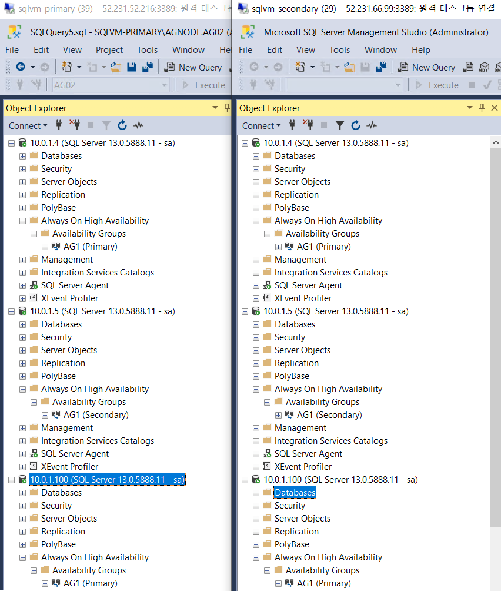

