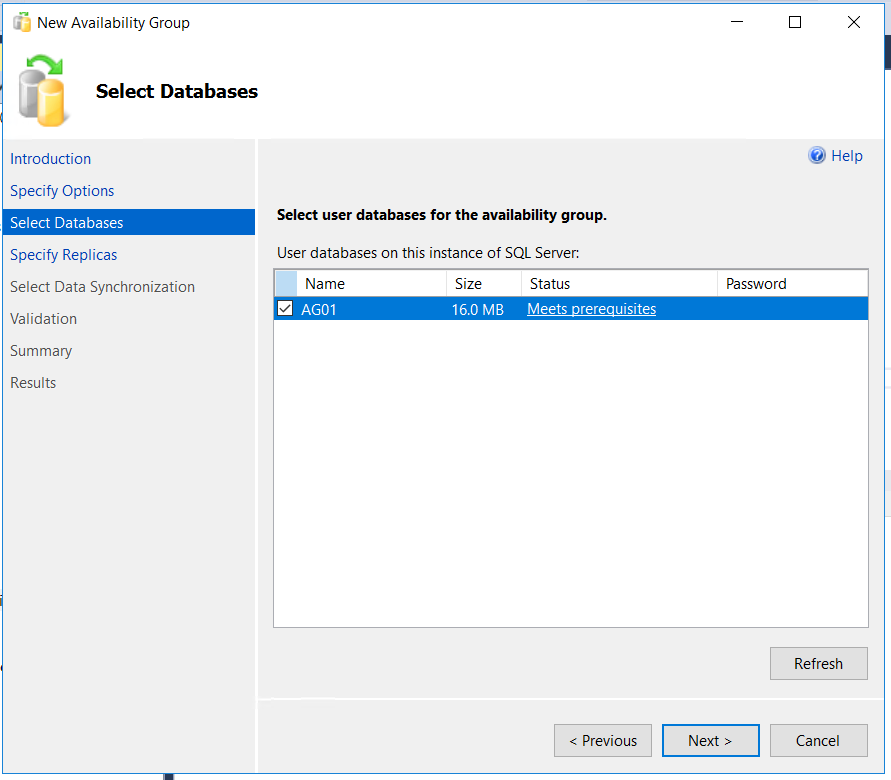
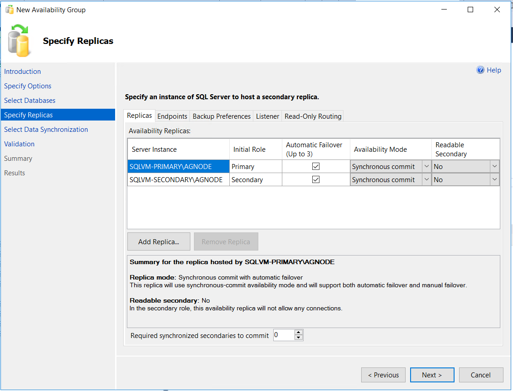

# 6. AlwaysOn Group 생성

## Database 생성 및 백업 

SQLVM-PRIMARY에서 DB 생성 및 백업 


```bash
create database AG01;

use AG01;

create table dbo.test_tbl (id int, memo nvarchar(100));

insert into dbo.test_tbl values(1,'aaa'),(2,'bbb'),(3,'ccc');

select * from dbo.test_tbl

backup database [ag01] to  disk = N'f:\backup\ag01.bak';
```


가용성 그룹 생성시 DB FULL 백업이 되어있어야 함


가용성 그룹 생성 마법사 실행 


다음 


가용성 그룹 이름 입력 후 다음 


가용성 그룹에 포함할 데이터베이스 선택 후 다음 



Add Replica 클릭 후 SQLVM-SECONDARY 추가 




Automatic Failover 체크 해줘야 장애 발생시 자동 Failover 


엔드포인트 확인


백업 옵션 적절히 선택 


리스너 생성 LSN01, 10.0.1.100 STATIC IP 설정 


동기화 옵션 선택에서 Automatic seeding 을 선택 



Database가 대용량일 경우 SQLVM-PRIMARY와 SQLVM-SECONDARY에 복원 후 join only를 사용하면 속도 측면에서 빠르다고 함 


다음 


완료 


완료된 상태 


완료 후 SQLVM-PRIMARY서버에 다음과 같이 가용성 그룹이 생성됨 


SQLVM-SECONDARY 서버에 직접 접속하여 동일하게 구성 되었고 DB클릭시 액세스 불가 에러 메세지 발생 


