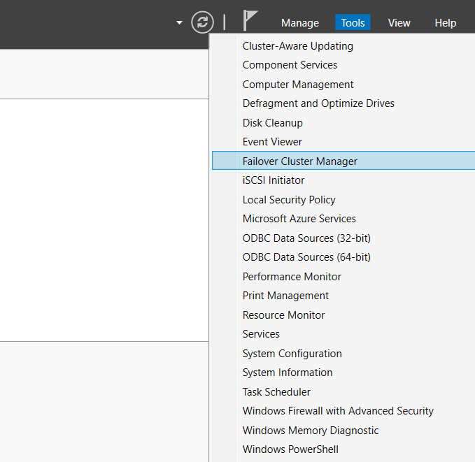
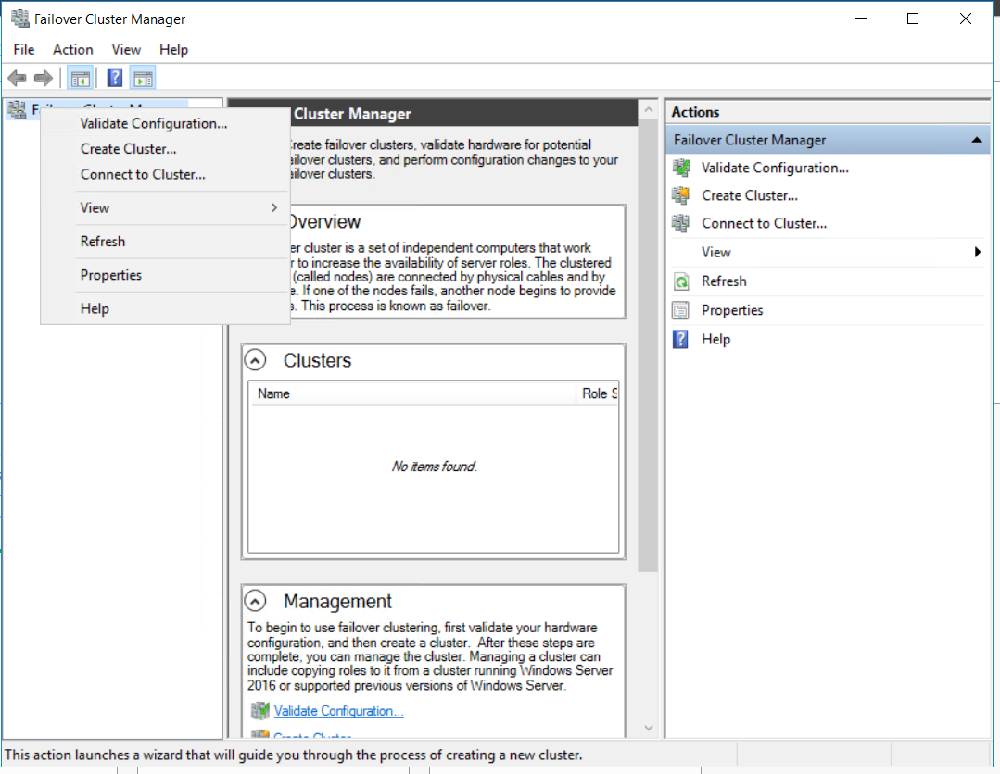
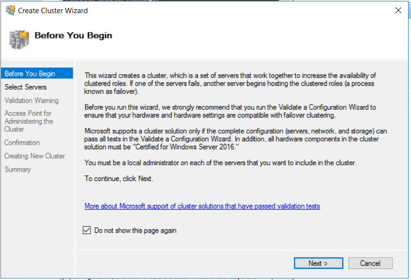
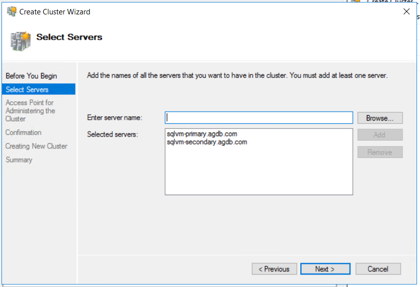

# 4. Failover Cluster 구성

## Failover Cluster 생

Failover Cluster Manager 실



Create Cluster 클



체크박스 체크 후 다



SQLVM-PRIMARY와 SQLVM-SECONDARY 노드를 도메인 주소 입력 후 추가



ㄴㅁ



 Super-powers are granted randomly so please submit an issue if you're not happy with yours.


Once you're strong enough, save the world:


```bash
# Ain't no code for that yet, sorry
echo 'You got to trust me on this, I saved the world'
```



