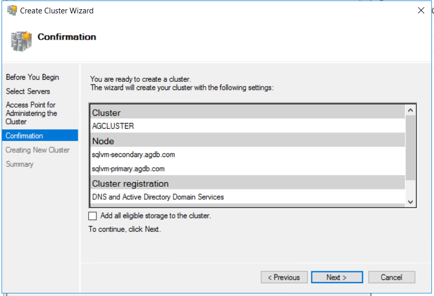
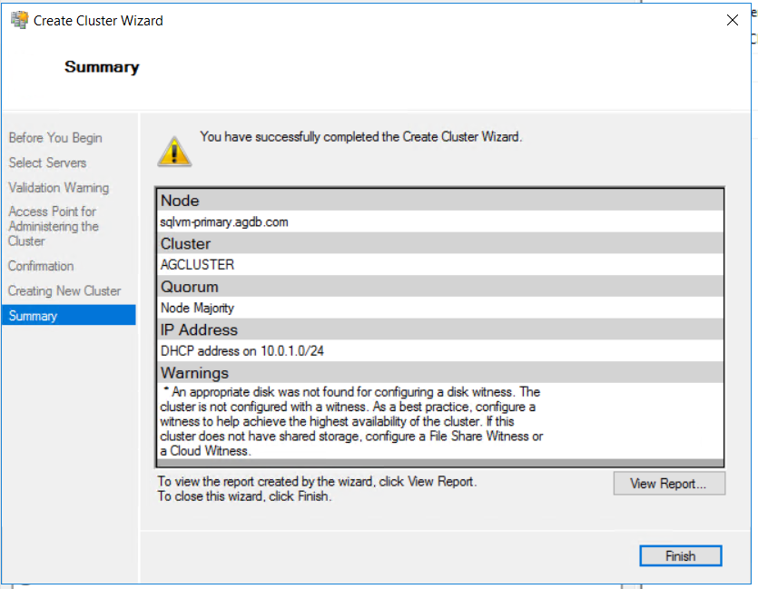
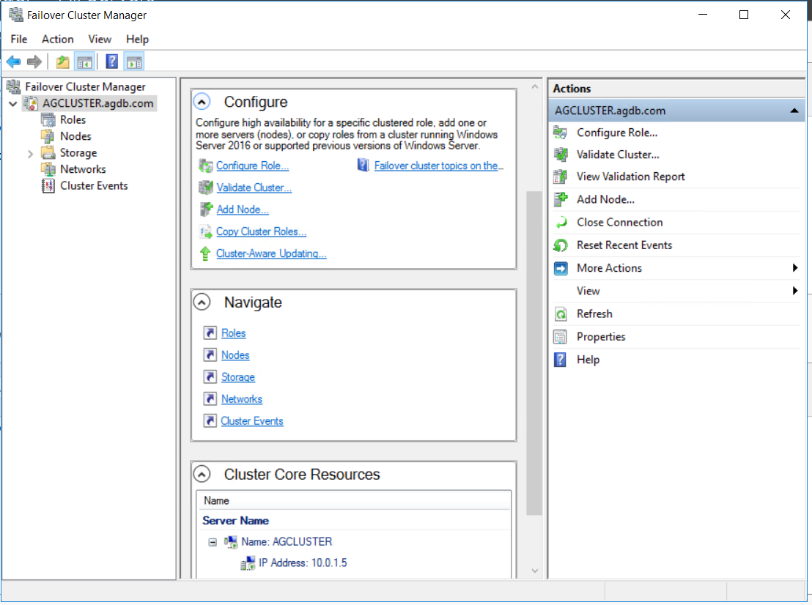
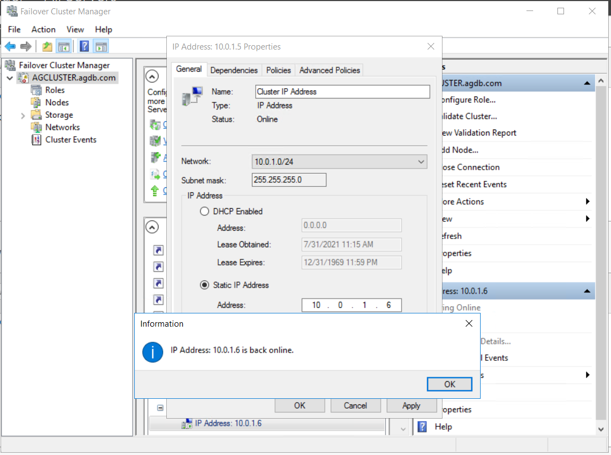

# 4. Failover Cluster 구성

## Failover Cluster 생

Failover Cluster Manager 실


Create Cluster 클


다음 


SQLVM-PRIMARY, SQLVM-SECONDARY 입력 후 다음 


유효성 검사에 아니오, 다음 


클러스터 이름 입력, 다음 


클러스터에 사용할 수 있는 모든 스토리지 추가에 체크 해제 




사용할 수 있는 모든 스토리지 추가 체크시 로컬 디스크가 클러스터 디스크로 사용된다고 함     링크 참조 : [https://docs.microsoft.com/ko-kr/azure/azure-sql/virtual-machines/windows/availability-group-manually-configure-tutorial\#feedback](https://docs.microsoft.com/ko-kr/azure/azure-sql/virtual-machines/windows/availability-group-manually-configure-tutorial#feedback) 


생성 완료 



완료 클릭 후 클러스터 IP가 DHCP 형태로 할당 받아 서버 IP와 중복되어 일부 오류메세지 발생함  
클러스터 IP를 변경하여 STATIC 으로 바꿔줌   




클러스터 IP를 10.0.1.6으로 바꾸고 STACTIC으로 변경




클러스터 생성시 GUI 보다는 아래 shell 스트립트로 진행하는것이 좋을듯


```text

```

