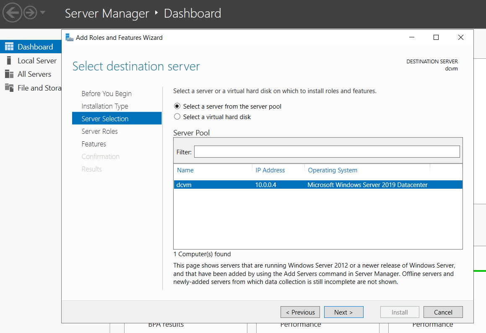
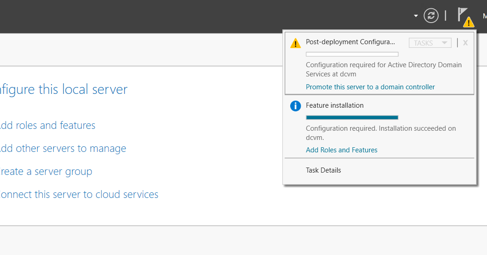
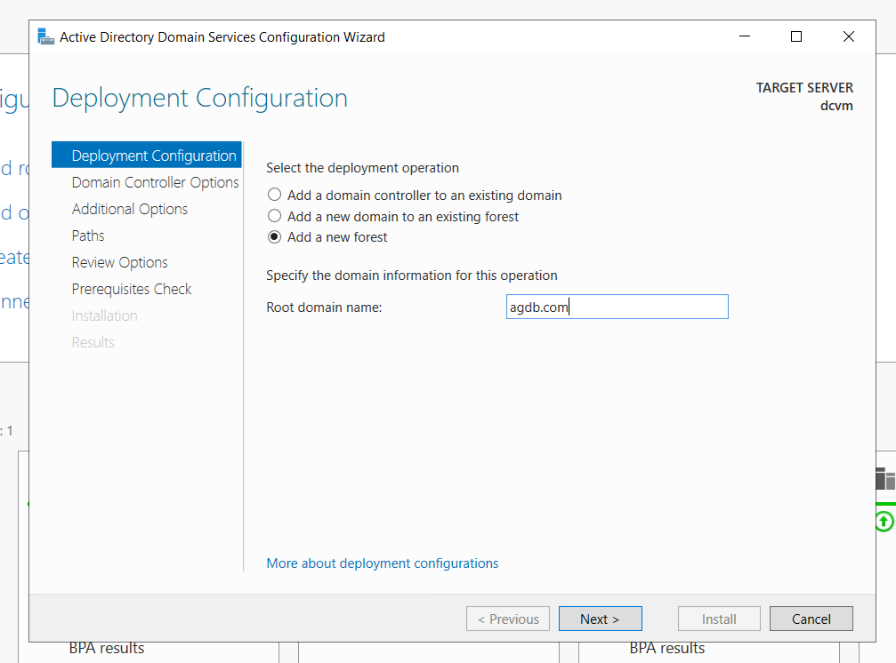
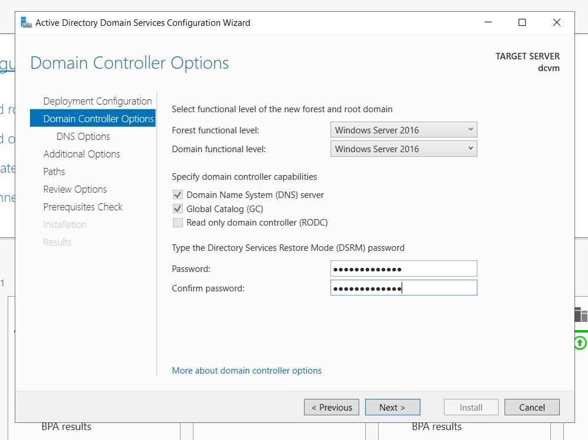
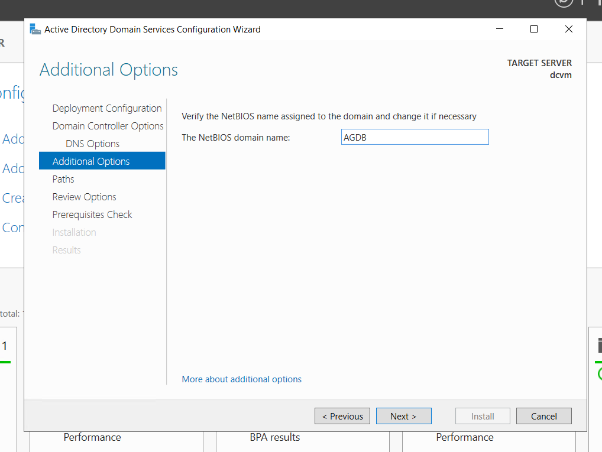
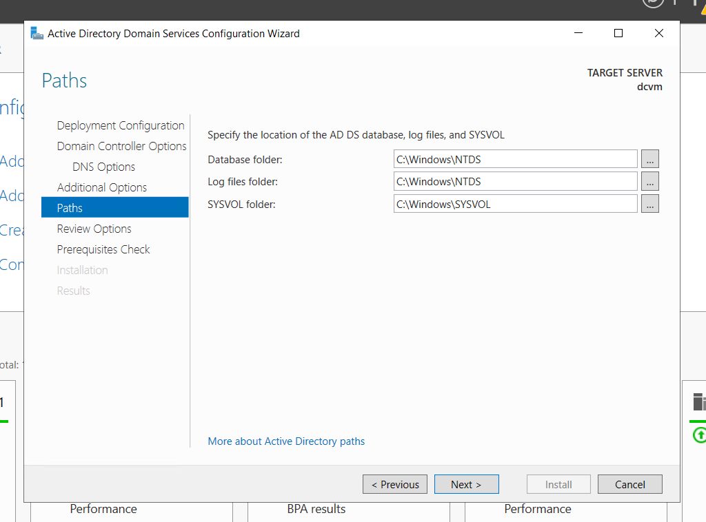
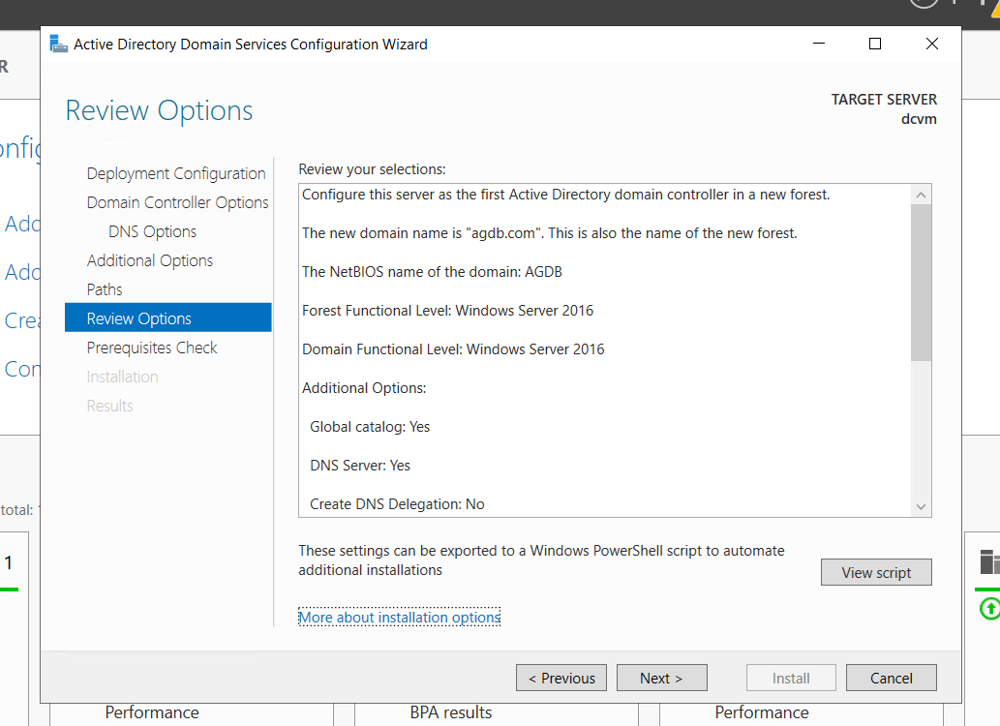
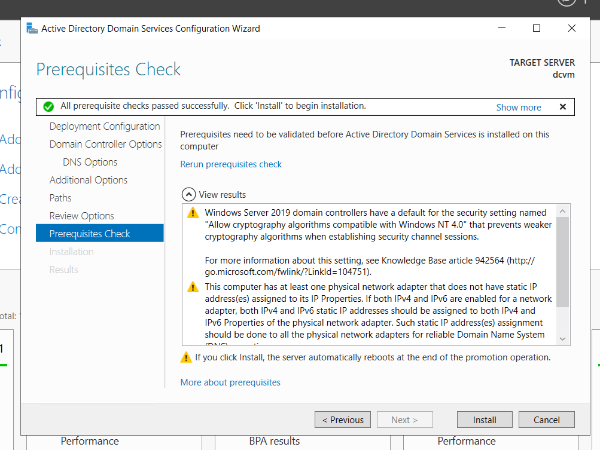
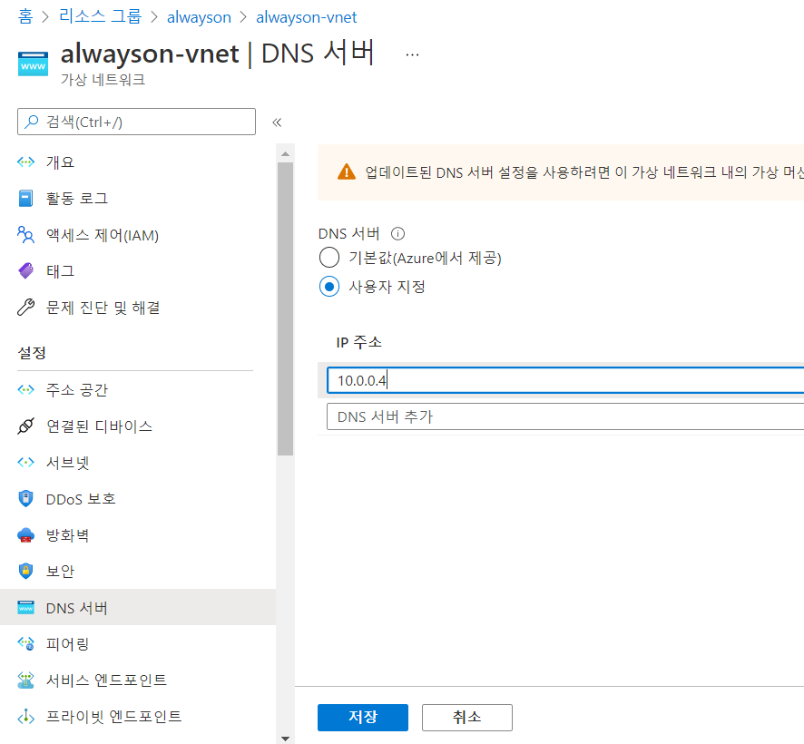

# 2. Domain Controller 설치

## Azure Portal에서 dcvm RDP 접속

### Role and features 설치

Add roles and features 클릭 

다음

다

다음 

Server Roles에서 AD서비스와 DNS Server를 선택

DNS Server 선택시 동적IP 경고가 뜬다 일단 다음을 누르고 portal에서 IP를 정적으로 바꿔줌 

AD 서비스와 DNS Sever 체크 후 다음

다음 

다음 

다음 

재시작 체크 후 확인, install

설치되는 동안 리소스 그룹에서 dcvm NIC IP 구성에서 프라이빗 IP 주소를 정적으로 변경 

정적으로 변경 후 저장, dcvm, sqlvm 모두 프라이빗 IP를 정적으로 변경\(PIP는 모두 정적으로 생성됨\) 

### Domain Controller 승격

promote this server to a domain controller 클릭

Add a forest 선택 후 도메인명 agdb.com 입력

암호입력

Create DNS delegation 옵션은 정확히 모르겠으나 체크 해제 후 넘어감\(체크시 next 불가\)    

다음 

다음 

다음 

install 시작 완료 후 재부팅 

### Azure Portal DNS 설정

리소스 그룹에서 Vnet의 DNS 서버 사용자 지정 IP\(dcvm 프라이빗 IP\) 입력

