# 8. 수동 Failover

## 쿼리로 수동 Failover 

먼저 각 서버에 접속 확인 SQLVM-PRIMARY 서버에 AG가 \(primary\),   
SQLVM-SECONDARY 서버에 AG가 \(secondary\)로 되어있음 

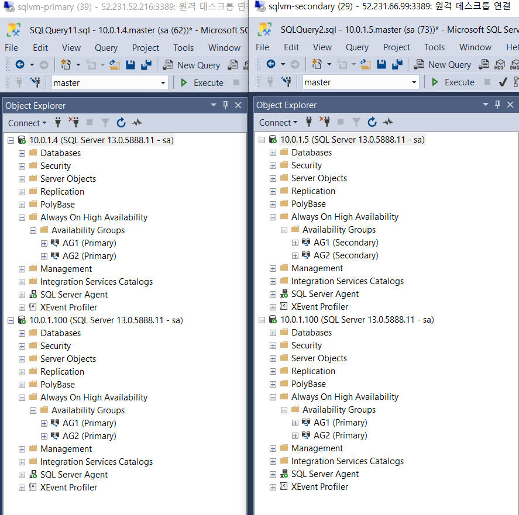


수동 Failover시 Failover 할 대상 서버에 직접 접속 후 쿼리를 실행해야 됨 


리스너 접속 또는 PRIMARY 서버에서 수동 Failover 쿼리를 실행 할 경우 오류 발생 

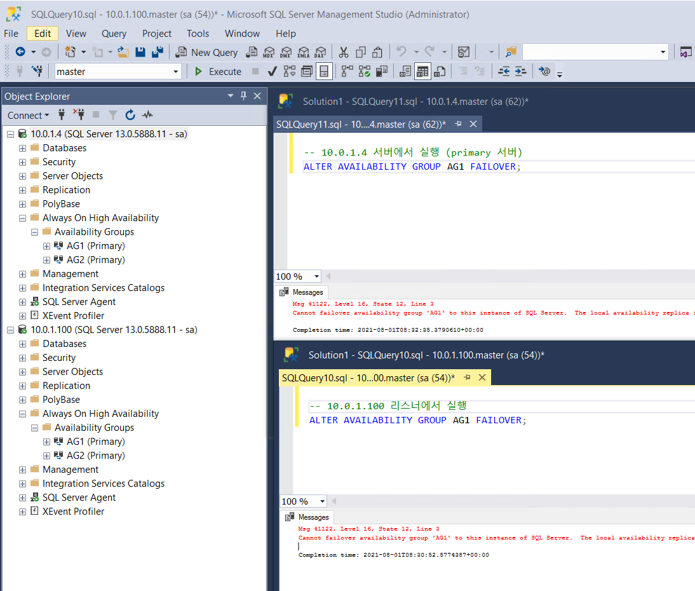

```text
Cannot failover availability group 'AG1' to this instance of SQL Server.  
The local availability replica is already the primary replica of the availability group.  
To failover this availability group to another instance of SQL Server, run the failover command on that instance of SQL Server.  
If local instance of SQL Server is intended to host the primary replica of the availability group, then no action is required.
```

Failover 대상 서버에 접속 후 진행 

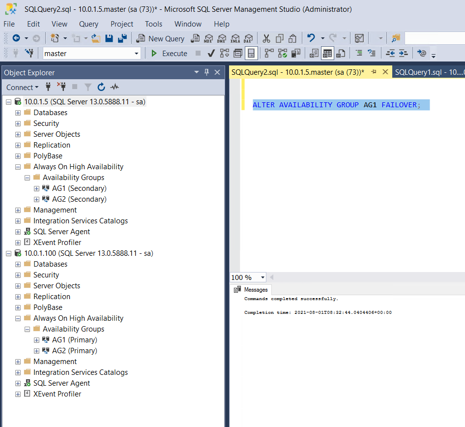

서버 새로고침 후 AG1의 가용성 그룹이 secondary에서 primary로 바뀜

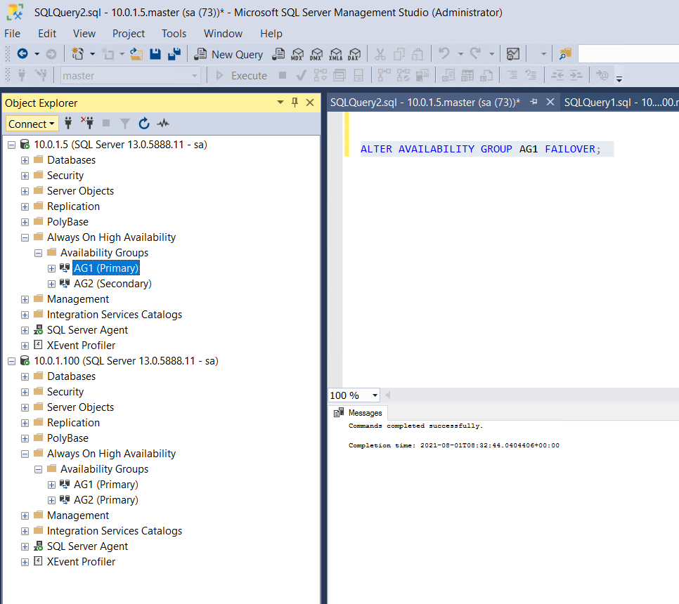

## 장애상황 발생시 자동 Failover

SQLVM-PRIMARY 서버 중지 

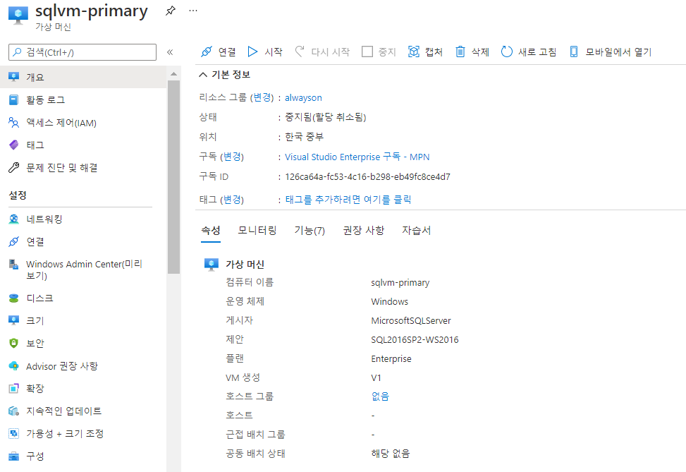

SQLVM-SECONDARY 서버 접속 후 상태 확인 

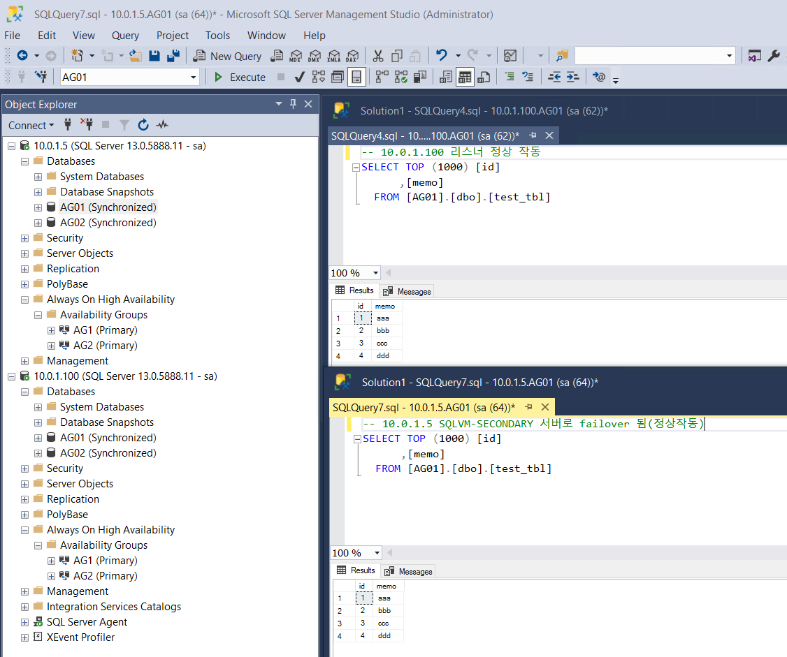


운영서버 중지 후 모든 가용성 그룹이 SQLVM-SECONDARY 서버로 바뀌고 자동 failover 됨   
10.0.1.5 서버의 가용성 그룹이 모두 \(primary\)로 바뀐걸 볼 수 있다. 오 신기신기 정상 작동함


이 상태에서 데이터 추가 입력 후 다시 Failover 테스트 

```text
  insert into [AG01].[dbo].[test_tbl] values(5,'eee');
  insert into [AG01].[dbo].[test_tbl] values(6,'fff');
  insert into [AG01].[dbo].[test_tbl] values(7,'ggg');
```

SQLVM-PRIMARY 서버 재기동 후 기존 가용성 그룹 오류 상황 발생함  
SQLVM-SECONDARY 서버는 가용성 그룹이 정상적으로 있으나 SQLVM-PRIMARY 서버에는 AG2 가용성 그룹이 사라지고 AG02 DB는 계속 Restoreing 

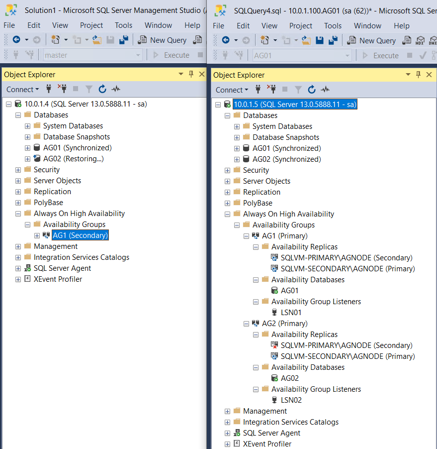

SQLVM-PRIMARY 서버에 Restoring인 DB를 삭제 후 SQLVM-SECONDARY 가용성 그룹의 Replica 삭제  
\(Remove from Availability Group\) 

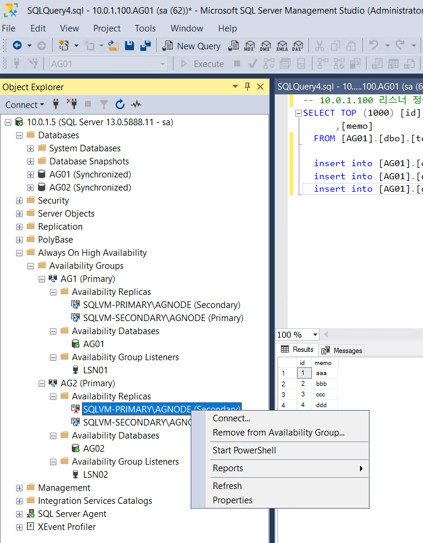


이후 Add Replica 하여 다시 추가 

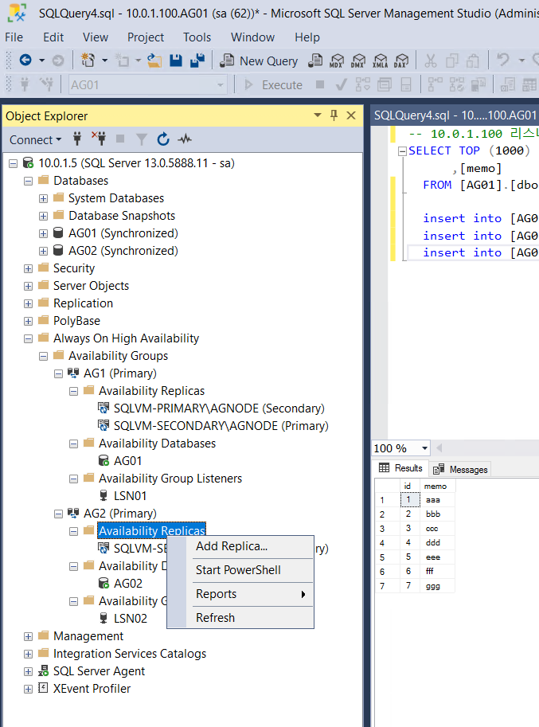

가용성 그룹 생성과 동일하게 다시 생성함\(리스너는 새로 생성 X\)

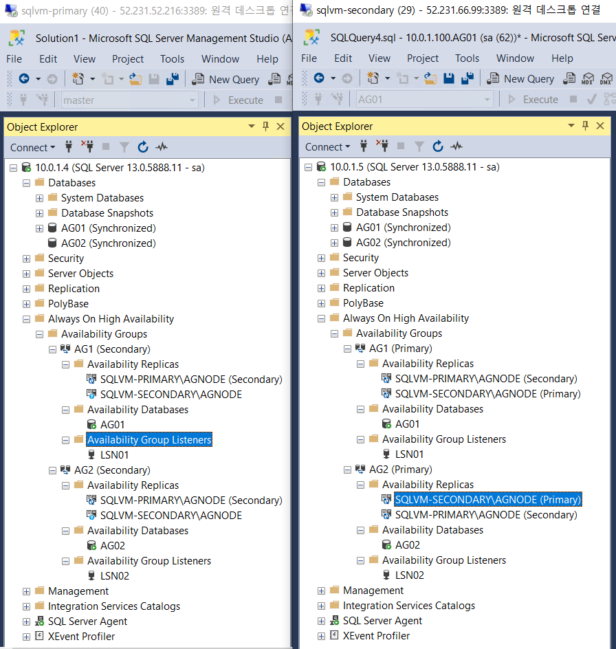

이후 다시 SQLVM-PRIMARY로 수동 Failover 시켜봄

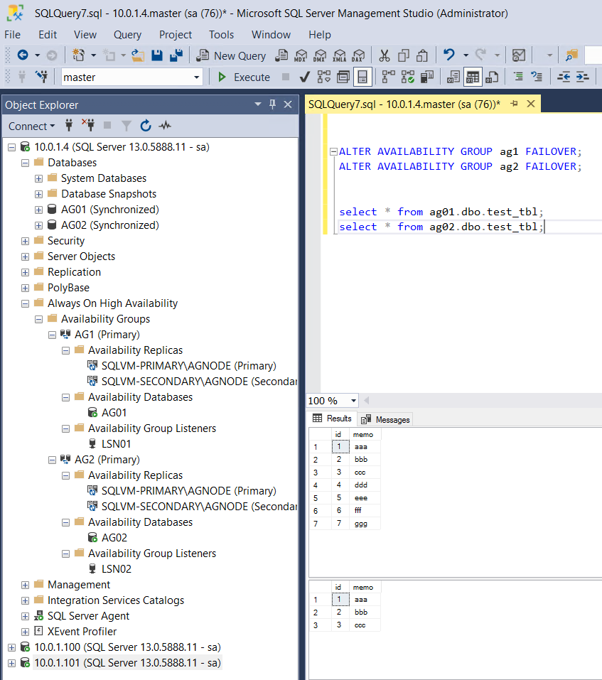


AG01 DB는 SQLVM-PRIMARY 서버 중지시 추가 입력한 5,6,7 데이터까지 정상 Failover 됐고  
AG02 DB는 가용성 그룹에 문제가 생겼으나 restoring DB를 삭제하고 다시 가용성 그룹 구성하여   
수동 Failover 하니 잘 되었음

### \* 가용성 그룹 사용시 수동 or 장애시 Failover가 진행 될때 일부 DB 또는 가용성 그룹에 오류가 발생할 수 있음.. 이때 문제 DB 삭제 후 가용성 그룹 재구성하는 방법으로 진행하는것 같음 \(docx에 해결방법 찾아서 진행해야 할듯\)



 

