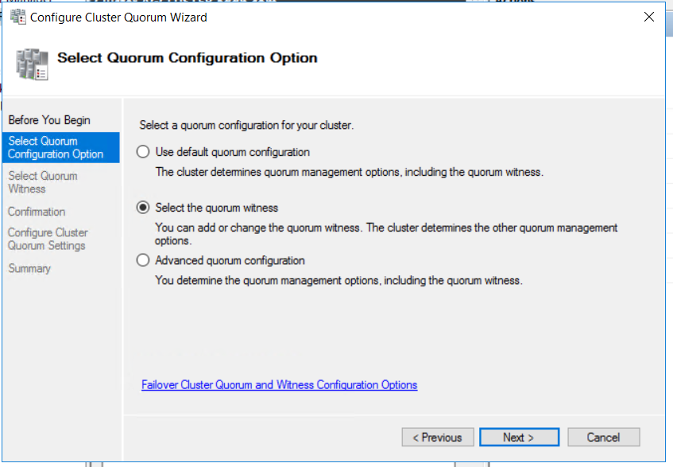
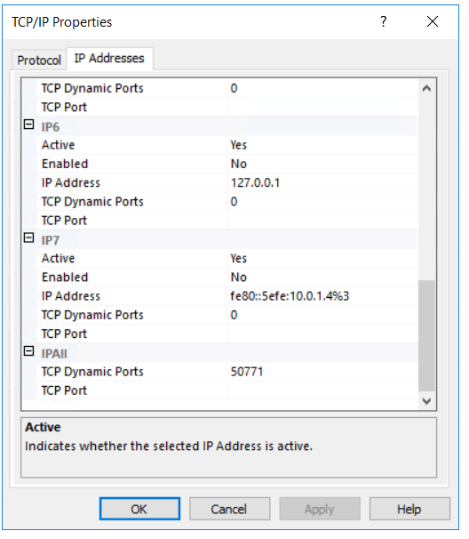

# 5. Quorum 구성

## Azure Storage Account 생성 

Azure Portal에서 아래와 같이 설정 후 나머지 옵션은 디폴트로 생성


## Cloud Witness Quorum 생성 

다시 SQLVM-PRIMARY 서버 접속 후 쿼럼 세팅 클


ㄴㄴ



ㅇㅇ


ㅌㅊ


ㅌㅌ


스토리지 계정과 공유 액세스 키 입력


위 상황에서 다음으로 진행시 TLS1.2에 대한 오류가 발생함..   
방법은 스토리지 계정의 TLS 최소 버전을 1.0으로 내리던지,   
아래 TLS 1.2를 클라이언트 어플리케이션단에서 사용하도록 세팅인데 아래의 클라이언트의 세팅은   
TLS 1.2 사용을 추가만 하는것인지? 아니면 TLS 1.2로만 사용을 하는지 좀 더 알아봐야 함..

여기서는 스토리지 계정의 최소 TLS 버전을 1.0로 낮추고 진행  


관련 내용 링크 :  
[https://docs.microsoft.com/ko-kr/azure/storage/common/transport-layer-security-configure-client-version?toc=%2Fazure%2Fstorage%2Fblobs%2Ftoc.json&tabs=powershell](https://docs.microsoft.com/ko-kr/azure/storage/common/transport-layer-security-configure-client-version?toc=%2Fazure%2Fstorage%2Fblobs%2Ftoc.json&tabs=powershell)

```text
# Set the TLS version used by the PowerShell client to TLS 1.2.
[System.Net.ServicePointManager]::SecurityProtocol = [System.Net.SecurityProtocolType]::Tls12;
```

## 가용성 그룹 사용

SQL Server configuration에서 SQL Server 서비스의 가용성 그룹 Enable 후 서버 재시작  
SQLVM-PRIMARY, SQLVM-SECONDARY 모두 진  


SQL Server Network 서비스에서 TCP/IP에서 속성 클릭  



동적 포트를 1433 정적 포트로 변경, SQLVM-PRIMARY, SQLVM-SECONDARY 모두 진행 


구성 완료 후 커넥션 확



SQLVM-PRIMARY와 SQLVM-SECONDARY 각 서버에서 윈도우 인증으로 접속한 상태   
\(한 서버에서 IP로 접속시 양쪽 두 서버 윈도우 인증으로 접속 가능\) 



