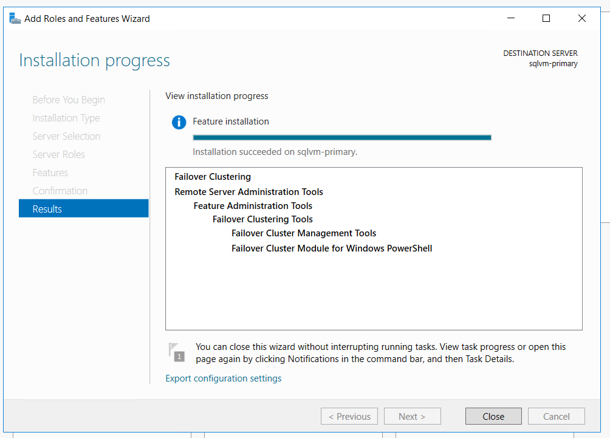

# 3. SQL Server 설치

## SQL Server 기본 인스턴스 삭제 

sqlvm-primary, sqlvm-secondary 두 서버 모두 기본 인스턴스 삭제 

Remove 클릭 후 기본 인스턴스 삭제 

Database Engine Services 체크 후 삭제 

삭제 완료 

## 방화벽 오픈 

sqlvm-primary, sqlvm-secondary 두 서버 모두 인바운드 방화벽 포트 오픈 

* SQL Server VM port 1433
* Azure 부하 분산 장치 프로브 59999
* Database mirroring 5022

## Failover Clustering Feature 설치

sqlvm-primary, sqlvm-secondary 두 서버 모두 ​failover clustering feature 설

Add roles and features 클릭

다음

다음

다음 

Failover Clustering 체크 

Install 

설치 완료 후 재부팅

## Domain Join 

sqlvm-primary, sqlvm-secondary 두 서버 모두 도메인 가입

### 도메인 가입전 Azure Portal NIC DNS 설정

sqlvm-primary DC 서버인 10.0.0.4 IP 추가 

sqlvm-secondary DC 서버인 10.0.0.4 IP 추가 

sqlvm-primary RDP 접속 후 도메인 가입

sqlvm-secondary RDP 접속 후 도메인 가입

도메인 가입 후 재부팅하여 agdb\clooadmin의 도메인 계정으로 접속 

## SQL Server 재설치 

SQL 설치미디어로 인스턴스 재설치

